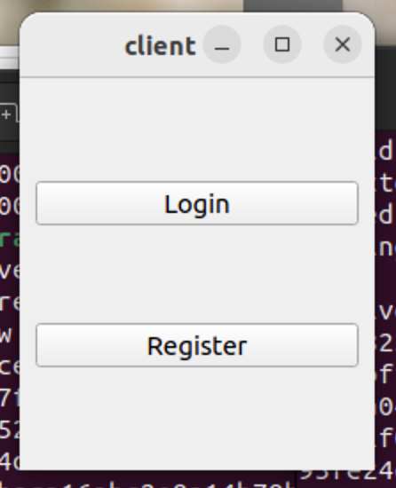
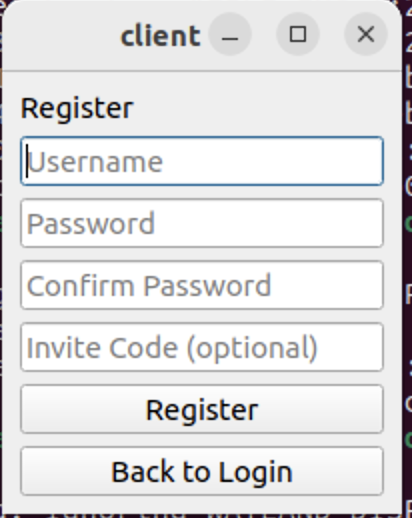
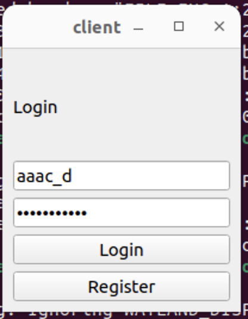
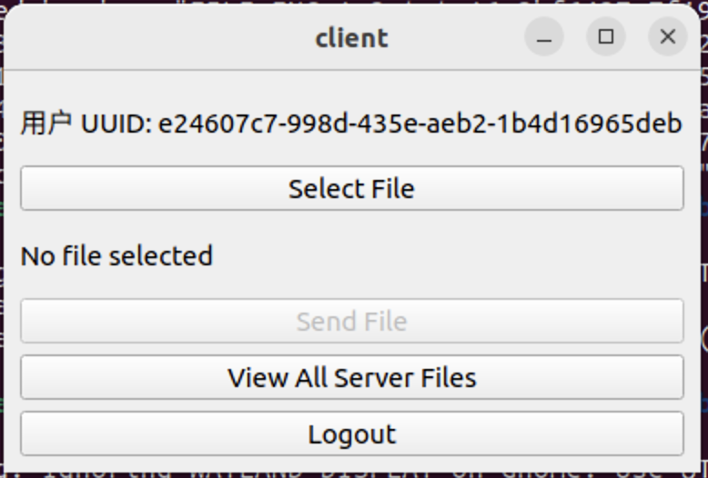
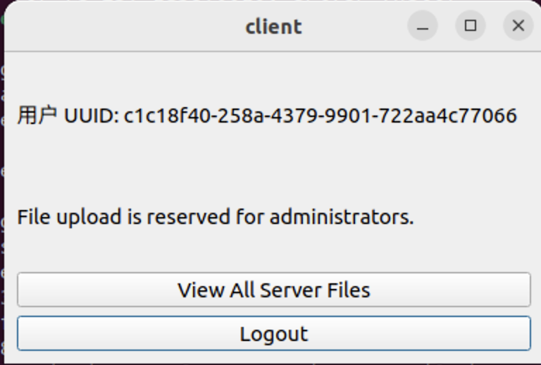
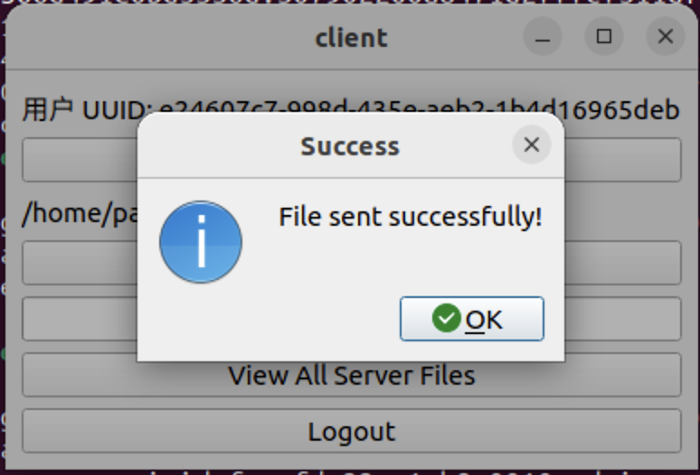
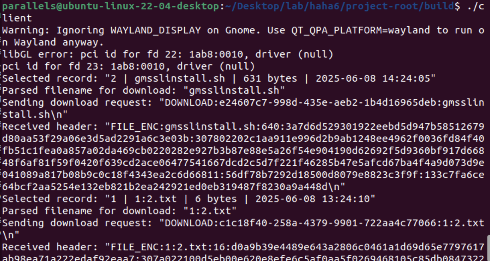
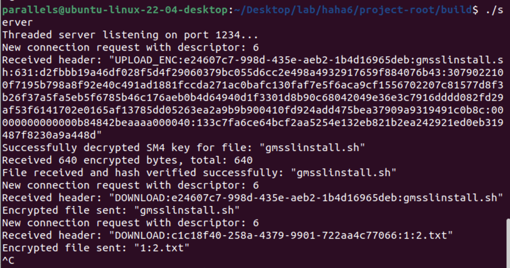

# 基于QT和国密算法的安全文件传输系统

## 1. 功能和代码链接

本系统是一个基于C/S（客户端/服务器）架构的安全文件传输应用，利用Qt框架构建图形用户界面，并集成国密算法（SM2, SM3, SM4）来确保通信过程的安全性。

### 1.1 功能列表

- 用户身份鉴别
  - 用户注册
  - 用户登录
  - 管理员身份识别
- 文件安全传输
  - 加密文件上传（仅限管理员）
  - 加密文件下载（所有用户）
- 访问控制
  - 基于用户角色的权限划分（管理员/普通用户）
- 安全审计
  - 服务器操作日志记录
- 文件历史追溯
  - 查看服务器上所有文件的传输记录

### 1.2 详细功能说明

1. **用户注册与登录**
   - 用户可以通过客户端提供用户名和密码进行注册。
   - 注册时，客户端会检查两次输入的密码是否一致。
   - 提供一个特殊的“邀请码”（`114514，如有需要可自定`）用于注册管理员账户。
   - 登录时，用户输入正确的用户名和密码即可进入文件传输主界面。
2. **文件上传（管理员权限）**
   - 管理员登录后，可以选择本地文件进行上传。
   - 文件在上传前，客户端会使用**SM3算法**计算其哈希值。
   - 客户端生成临时的**SM4会话密钥**和**SM2非对称密钥对**。
   - 使用**SM2公钥**加密**SM4会话密钥**。
   - 客户端将文件名、文件大小、加密后的SM4密钥、SM2私钥、SM4的初始化向量（IV）以及文件的SM3哈希值一起发送给服务器。
   - 文件内容使用**SM4算法（CBC模式）**进行加密后分块传输。
3. **文件下载**
   - 所有登录用户均可查看服务器上的文件列表并选择下载。
   - 服务器在收到下载请求后，同样采用**混合密码系统**：生成临时的SM2密钥对和SM4会话密钥。
   - 服务器使用SM4加密文件内容，并用SM2公钥加密SM4密钥。
   - 将加密的文件、加密后的SM4密钥、SM2私钥和文件哈希等元数据一同发送给客户端。
   - 客户端接收后，使用SM2私钥解密得到SM4密钥，再用SM4密钥解密文件内容。
   - 文件下载完成后，客户端会重新计算文件的SM3哈希值，并与服务器发来的哈希值进行比对，以校验文件完整性。
4. **访问控制**
   - 系统内定义了两种角色：**管理员**和**普通用户**。
   - **管理员**：拥有上传文件、下载文件和查看文件历史的全部权限。
   - **普通用户**：只能查看文件历史和下载文件，上传功能在界面上被禁用。
5. **审计日志**
   - 服务器会对关键操作进行记录，生成`audit.log`日志文件。
   - 记录内容包括：服务器启动与关闭、新用户连接与断开、用户上传/下载文件的尝试、成功与失败、密钥解密失败、哈希验证结果等。
   - 每条日志都包含精确的时间戳和事件描述，便于事后追溯和分析。

## 1.3 运行截图

1. 开始界面

   

2. 注册界面

   

3. 登录界面

   

4. 文件安全传输界面（管理员）

   

5. 文件安全传输界面（用户）

   

6. 传输文件成功弹窗（管理员）

   

7. 下载文件成功弹窗

   

8. 客户端终端回显

   

9. 服务端终端回显

## 1.4 代码链接

**GitHub 仓库地址**：https://github.com/FuckerLinda/learn_linux/tree/main/lab/基于QT和国密算法的安全文件传输系统

## 2. 密码技术与安全功能实现

### 2.1 系统安全性设计

系统设计的核心是**混合密码系统**，它结合了非对称加密（SM2）和对称加密（SM4）的优点。

- **非对称加密（SM2）**：用于安全地协商和分发一次性的对称会话密钥。由于其计算开销较大，不直接用于加密大量数据。
- **对称加密（SM4）**：用于高效地加密文件内容。其速度快，适合处理大文件。
- **哈希算法（SM3）**：用于验证用户口令和保证文件内容的完整性。

这种设计确保了即使传输通道被窃听，攻击者也无法获取原始文件内容和会话密钥。

### 2.2 密码应用场景

1. **用户口令存储 (SM3)**
   - 在用户注册和创建默认管理员账户时，系统不会直接存储用户的明文密码。
   - 系统会为每个用户生成一个16字节的随机**盐（Salt）**。
   - 将盐与用户输入的密码拼接后，使用SM3算法计算其哈希值。
   - 最终存储在`users.db`数据库中的是哈希值和盐值，而不是明文密码。
   - **实现代码**：`DBManager::hashPasswordWithSalt()`
2. **文件加密传输 (SM2 + SM4)**
   - **上传过程**：客户端在`MainWindow::onConnected()`函数中，生成SM2密钥对和SM4会话密钥。使用SM2公钥加密SM4密钥，然后将文件主体用SM4加密后传输。
   - **下载过程**：服务器在`SocketHandler::handleDownloadRequest()`函数中执行相同的混合加密流程，保证数据在下载过程中同样是加密的。
3. **文件完整性校验 (SM3)**
   - **上传前**：客户端在`MainWindow::onSendButtonClicked()`函数中，计算待上传文件的SM3哈希，并将其随元数据发送给服务器。
   - **上传后**：服务器在`SocketHandler::processEncryptedData()`中，接收完文件后，对解密后的文件内容重新计算SM3哈希，并与客户端发来的哈希进行比对。结果会被记录在审计日志中。
   - **下载后**：客户端在`FileHistoryDialog::completeDownload()`函数中，对下载完成的文件进行哈希计算，并与服务器发来的原始哈希比对，通过弹窗告知用户校验结果。

### 2.3 安全功能实现

1. **身份认证**
   - 在`dbmanager.cpp`中实现。当用户登录时 (`DBManager::loginUser`)，系统会根据用户名从数据库中检索出对应的盐和存储的哈希值。
   - 使用相同的盐和用户输入的密码计算一个新的哈希值。
   - 只有当计算出的哈希值与数据库中存储的哈希值完全一致时，身份认证才成功。
   - 由于SM3是单向哈希函数，即使数据库泄露，攻击者也无法从哈希值和盐反推出原始密码。
2. **访问控制**
   - 通过数据库中的`is_admin`字段实现。该字段在用户注册时根据邀请码确定。
   - 用户登录成功后 (`MainWindow::handleLogin`)，客户端会调用`DBManager::isAdminUser()`查询用户的管理员状态。
   - 根据返回的状态，`MainWindow::updateUIForPermissions()`函数会动态调整UI：对普通用户禁用“选择文件”和“发送文件”按钮，从而在客户端层面限制了上传操作。
3. **审计日志**
   - 通过一个单例模式的`AuditLogger`类实现，确保所有线程和模块都可以安全地向同一个日志文件写入。
   - 服务器端的`SocketHandler`在处理连接、接收数据、处理文件请求的各个关键节点调用`AuditLogger::instance().logEvent()`来记录事件。
   - 使用`QMutex`保证了在多线程环境下日志写入的原子性，防止日志内容交错混乱。
   - 日志文件`audit.log`保存在服务器可执行文件同目录下，记录了详细的操作信息，满足了审计要求。

## 3. 系统改进与展望

### 3.1 已完成的改进

（此部分可根据您实际的开发迭代过程填写，以下为示例）

- **功能完整性与用户体验优化**

  - **管理员注册机制**：引入了邀请码（`114514`）机制，使得管理员账户可以通过特定的注册流程创建，而不是硬编码在程序中。

  - **数据库自动初始化**：首次启动时，系统会自动创建数据库文件并添加一个默认的管理员账户（用户名/密码: a/a），简化了初次部署的流程。

  - **登出功能**：在客户端主界面添加了“登出”按钮，允许用户安全地清除会话信息并返回登录页面，提升了使用的灵活性和安全性。

  - **全局文件共享**：修改了文件历史记录的查看逻辑，从只能查看各自的上传记录，改进为所有用户都可以查看和下载服务器上的所有文件，实现了文件共享功能。

- **服务器架构与性能提升**

  - **高并发处理能力**：将服务器从单线程模型重构为多线程模型 (`ThreadedServer`)。现在每个客户端连接都在一个独立的线程中处理，避免了连接之间的阻塞，极大地提高了服务器的并发处理能力和响应速度。相应的，主函数中也弃用了旧的 `newConnection` 连接处理方式。
  - **核心功能增强**：为了支持文件完整性校验，在客户端添加了用于暂存上传文件哈希值的成员变量 (`m_uploadFileHash`)。

- **健壮性与问题修复**

  - **协议解析修复**：修复了服务器端一个关键的正则表达式逻辑错误。原有的贪婪匹配模式（`(.+)`）会导致在解析客户端发来的`UPLOAD_ENC`指令时无法正确提取文件名，现已通过非贪婪匹配（`(.+?)`）解决，确保了文件上传功能的正常运作。

  - **编译及运行时错误修复**：解决了开发过程中遇到的一系列问题，包括：
  - 因GmSSL库API使用不当或版本差异引发的编译和链接错误。
    - 解决了因内存未正确分配或访问失效指针导致的服务器段错误（闪退）问题。
  - 修复了大量因C++类型不匹配、变量作用域不当等引发的编译时错误。
  
- **多线程强化改进**
- **多线程服务器**：将原有的单线程阻塞模型改进为多线程模型 (`ThreadedServer`)，每个客户端连接都在一个独立的线程中处理，提高了服务器的并发处理能力和响应速度。
  
- **数据库交互优化**：将数据库操作封装在`DBManager`类中，并使用`QMutex`对数据库写操作进行加锁，保证了多线程环境下的数据一致性。

### 3.2 未来可改进的方向

- **更精细的访问控制**：可以实现基于文件级别的访问控制列表（ACL），允许文件所有者授权或拒绝其他特定用户下载其上传的文件。
