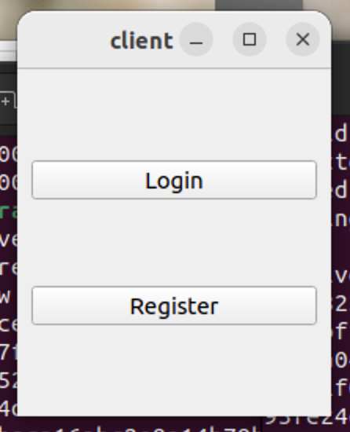
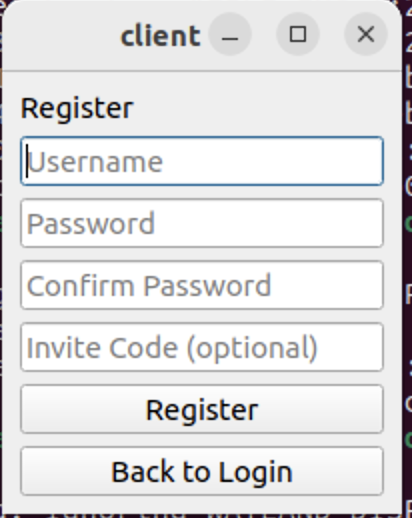
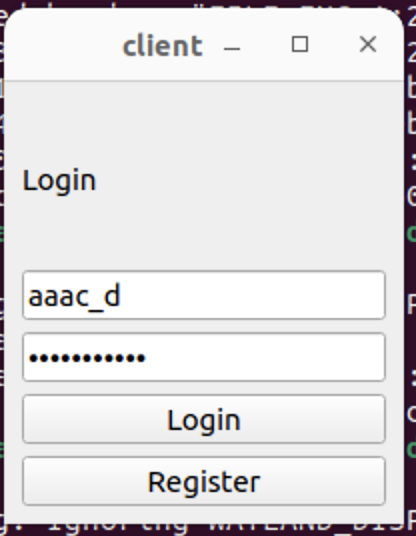
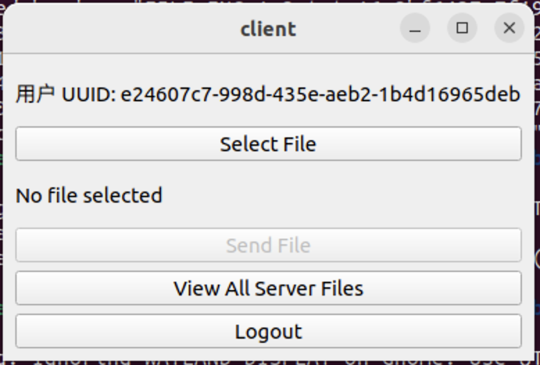
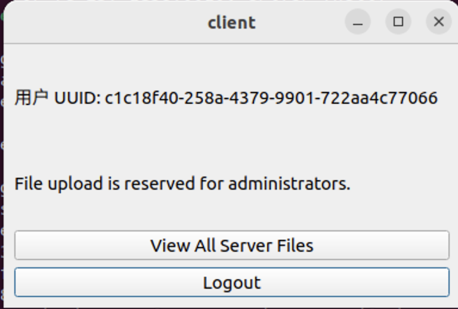
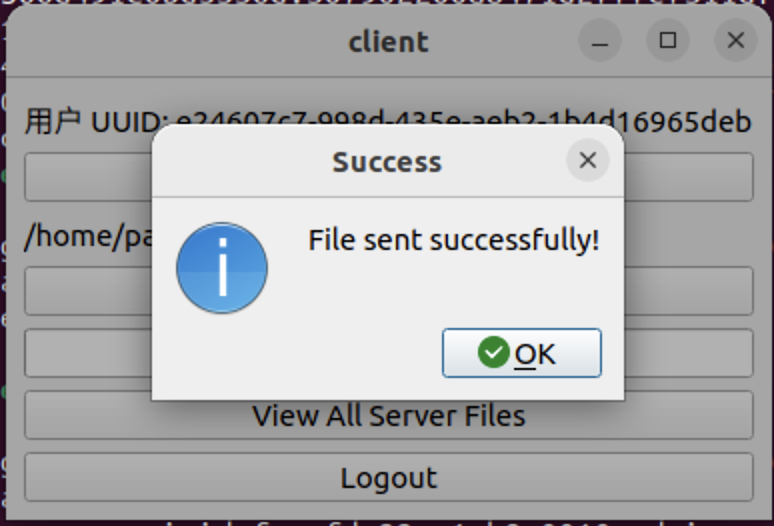
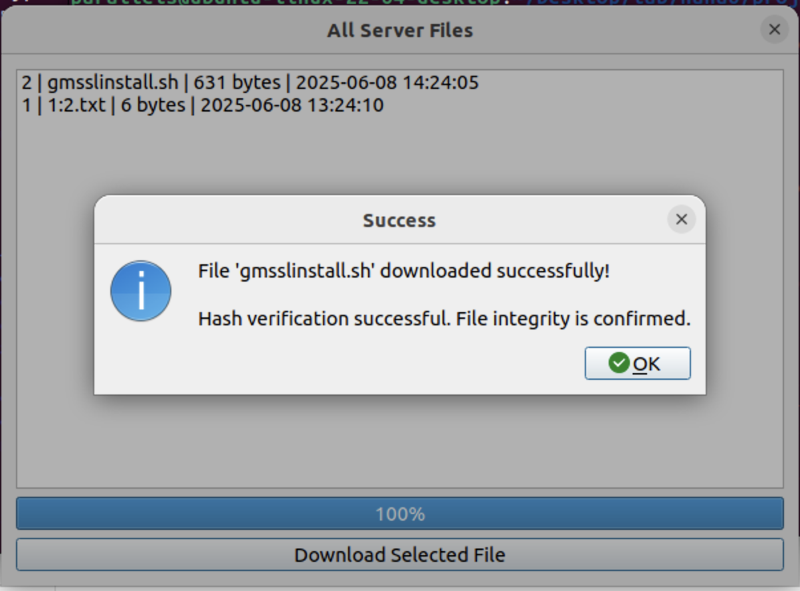
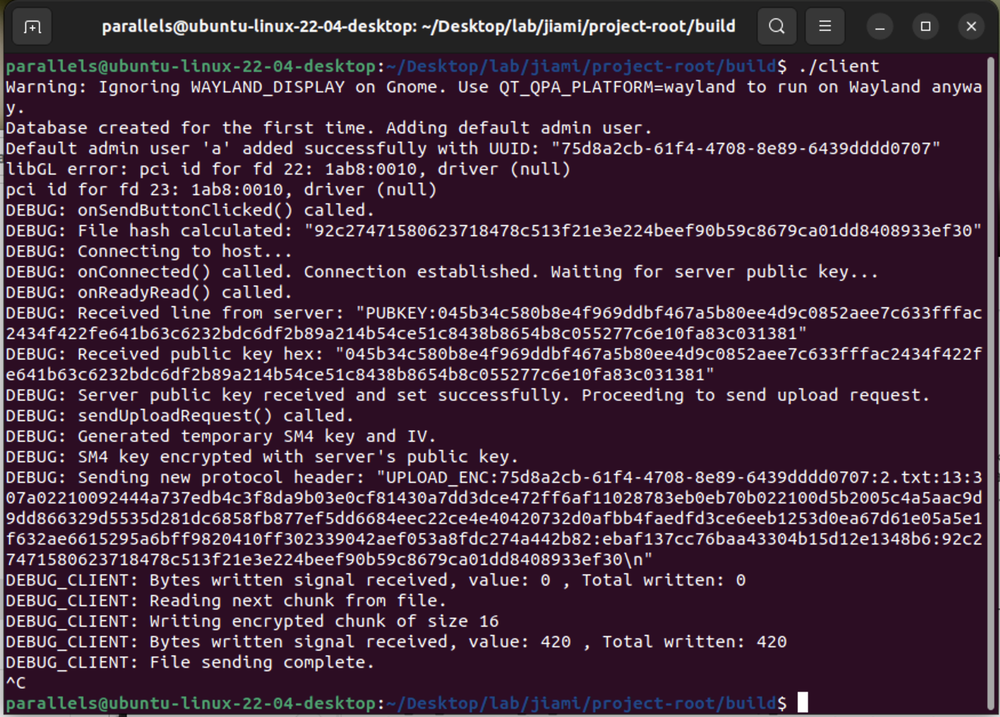
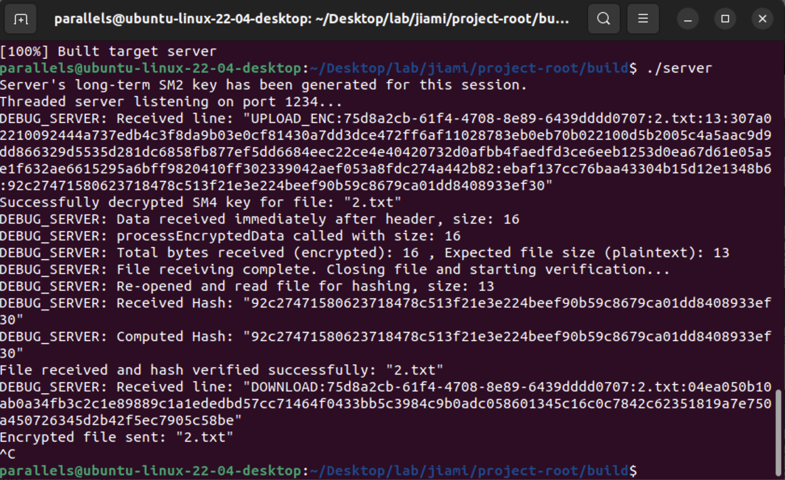
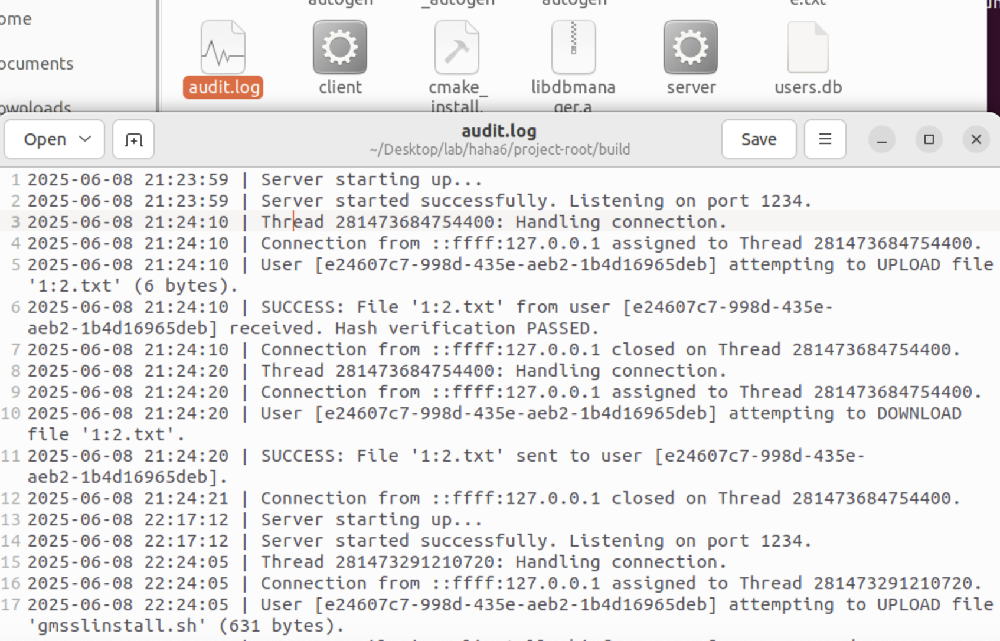

- [基于QT和国密算法的安全文件传输系统](#基于qt和国密算法的安全文件传输系统)
  - [1. 功能和代码链接](#1-功能和代码链接)
    - [1.1 功能列表](#11-功能列表)
    - [1.2 详细功能说明](#12-详细功能说明)
  - [1.3 运行截图](#13-运行截图)
  - [1.4 代码链接](#14-代码链接)
  - [2. 密码技术与安全功能实现](#2-密码技术与安全功能实现)
    - [2.1 系统安全性设计](#21-系统安全性设计)
    - [2.2 密码应用场景](#22-密码应用场景)
    - [2.3 安全功能实现](#23-安全功能实现)
  - [3. 系统改进与展望](#3-系统改进与展望)
    - [3.1 已完成的改进](#31-已完成的改进)
    - [3.2 未来可改进的方向](#32-未来可改进的方向)


# 基于QT和国密算法的安全文件传输系统

## 1. 功能和代码链接

本系统是一个基于C/S（客户端/服务器）架构的安全文件传输应用，利用Qt框架构建图形用户界面，并集成国密算法（SM2, SM3, SM4）来确保通信过程的安全性。

### 1.1 功能列表

- 用户身份鉴别
  - 用户注册
  - 用户登录
  - 管理员身份识别
- 文件安全传输
  - 加密文件上传（仅限管理员）
  - 加密文件下载（所有用户）
- 访问控制
  - 基于用户角色的权限划分（管理员/普通用户）
- 安全审计
  - 服务器操作日志记录
- 文件历史追溯
  - 查看服务器上所有文件的传输记录

### 1.2 详细功能说明

1. **用户注册与登录**
   - 用户可以通过客户端提供用户名和密码进行注册。
   - 注册时，客户端会检查两次输入的密码是否一致。
   - 提供一个特殊的“邀请码”（`114514，如有需要可自定`）用于注册管理员账户。
   - 登录时，用户输入正确的用户名和密码即可进入文件传输主界面。
2. **文件上传（管理员权限）**
   - 管理员登录后，可以选择本地文件进行上传。
   - 文件在上传前，客户端会使用**SM3算法**计算其哈希值。
   - 客户端连接成功后，**服务端会主动发送其长期持有的SM2公钥**给客户端。
   - 客户端接收并验证服务器的公钥后，生成一个临时的**SM4会话密钥**。
   - 客户端使用**从服务器获取的SM2公钥**来加密这个SM4会话密钥。
   - 客户端将文件名、文件大小、**加密后的SM4密钥**、SM4的初始化向量（IV）以及文件的SM3哈希值一起打包（**不再包含任何私钥**），发送给服务器。
   - 文件内容使用**SM4算法（CBC模式）**进行加密后分块传输。
3. **文件下载**
   - 所有登录用户均可查看服务器上的文件列表并选择下载。
   - 客户端在发起下载请求时，会先为本次下载**生成一对临时的SM2密钥对**，并将**临时公钥**随请求一起发送给服务器。
   - 服务器收到下载请求和客户端的临时公钥后，生成一个临时的SM4会话密钥。
   - 服务器使用从客户端收到的**临时公钥**来加密SM4会话密钥。
   - 服务器使用SM4加密文件内容，然后将加密后的文件、**加密后的SM4密钥**和文件哈希等元数据一同发回给客户端（**不发送任何私钥**）。
   - 客户端接收后，使用自己之前生成的**临时私钥**解密得到SM4密钥，再用SM4密钥解密文件内容。
   - 文件下载完成后，客户端会重新计算文件的SM3哈希值，并与服务器发来的哈希值进行比对，以校验文件完整性。
4. **访问控制**
   - 系统内定义了两种角色：**管理员**和**普通用户**。
   - **管理员**：拥有上传文件、下载文件和查看文件历史的全部权限。
   - **普通用户**：只能查看文件历史和下载文件，上传功能在界面上被禁用。
5. **审计日志**
   - 服务器会对关键操作进行记录，生成`audit.log`日志文件。
   - 记录内容包括：服务器启动与关闭、新用户连接与断开、用户上传/下载文件的尝试、成功与失败、密钥解密失败、哈希验证结果等。
   - 每条日志都包含精确的时间戳和事件描述，便于事后追溯和分析。

## 1.3 运行截图

1. 开始界面

   

2. 注册界面

   

3. 登录界面

   

4. 文件安全传输界面（管理员）

   

5. 文件安全传输界面（用户）

   

6. 传输文件成功弹窗（管理员）

   

7. 下载文件成功弹窗

   

8. 客户端终端回显

   

9. 服务端终端回显

   
   
10. 审计日志

   

## 1.4 代码链接

**GitHub 仓库地址**：https://github.com/FuckerLinda/learn_linux/tree/main/%20%E5%9F%BA%E4%BA%8EQT%E5%92%8C%E5%9B%BD%E5%AF%86%E7%AE%97%E6%B3%95%E7%9A%84%E5%AE%89%E5%85%A8%E6%96%87%E4%BB%B6%E4%BC%A0%E8%BE%93%E7%B3%BB%E7%BB%9F

[或者点这里](https://github.com/FuckerLinda/learn_linux/tree/main/%20%E5%9F%BA%E4%BA%8EQT%E5%92%8C%E5%9B%BD%E5%AF%86%E7%AE%97%E6%B3%95%E7%9A%84%E5%AE%89%E5%85%A8%E6%96%87%E4%BB%B6%E4%BC%A0%E8%BE%93%E7%B3%BB%E7%BB%9F)

## 2. 密码技术与安全功能实现

### 2.1 系统安全性设计

系统设计的核心是**混合密码系统**，它结合了非对称加密（SM2）和对称加密（SM4）的优点。

- **非对称加密（SM2）**：用于安全地协商和分发一次性的对称会话密钥。由于其计算开销较大，不直接用于加密大量数据。
- **对称加密（SM4）**：用于高效地加密文件内容。其速度快，适合处理大文件。
- **哈希算法（SM3）**：用于验证用户口令和保证文件内容的完整性。

这种设计确保了即使传输通道被窃听，攻击者也无法获取原始文件内容和会话密钥。

### 2.2 密码应用场景

1. **用户口令存储 (SM3)**
   - 在用户注册和创建默认管理员账户时，系统不会直接存储用户的明文密码。
   - 系统会为每个用户生成一个16字节的随机**盐（Salt）**。
   - 将盐与用户输入的密码拼接后，使用SM3算法计算其哈希值。
   - 最终存储在`users.db`数据库中的是哈希值和盐值，而不是明文密码。
   - **实现代码**：`DBManager::hashPasswordWithSalt()`
2. **文件加密传输 (SM2 + SM4)**
   - **上传过程**：
     - 客户端连接服务器后，在 `onReadyRead()` 函数中接收并解析服务器通过`PUBKEY:`指令发来的长期SM2公钥。
     - 在 `sendUploadRequest()` 函数中，客户端生成临时的SM4会话密钥，并调用`sm2_encrypt`函数，使用**服务器的公钥**对SM4密钥进行加密。
     - 客户端发送不包含任何私钥的`UPLOAD_ENC:`指令头。
     - 在`onBytesWritten()`函数中，使用SM4密钥加密文件块并发送。
   - **下载过程**：
     - 客户端在 `FileHistoryDialog::onDownloadClicked()` 函数中，为本次下载生成一对临时的SM2密钥对 `m_download_sm2_key`。
     - 在 `onDownloadConnected()` 中，将临时SM2**公钥**随`DOWNLOAD:`请求一同发送给服务器。
     - 服务器在`SocketHandler::handleDownloadRequest()`函数中，使用客户端发来的公钥加密一个新的SM4密钥，并将加密结果和加密文件发回。
     - 客户端在`FileHistoryDialog::onDownloadReadyRead()`中，使用自己持有的临时SM2**私钥**`m_download_sm2_key`，通过`sm2_decrypt`函数解密出会话密钥，进而解密文件。
3. **文件完整性校验 (SM3)**
   - **上传前**：客户端在`MainWindow::onSendButtonClicked()`函数中，计算待上传文件的SM3哈希，并将其随元数据发送给服务器。
   - **上传后**：服务器在`SocketHandler::processEncryptedData()`中，接收完文件后，对解密后的文件内容重新计算SM3哈希，并与客户端发来的哈希进行比对。结果会被记录在审计日志中。
   - **下载后**：客户端在`FileHistoryDialog::completeDownload()`函数中，对下载完成的文件进行哈希计算，并与服务器发来的原始哈希比对，通过弹窗告知用户校验结果。

### 2.3 安全功能实现

1. **身份认证**
   - 在`dbmanager.cpp`中实现。当用户登录时 (`DBManager::loginUser`)，系统会根据用户名从数据库中检索出对应的盐和存储的哈希值。
   - 使用相同的盐和用户输入的密码计算一个新的哈希值。
   - 只有当计算出的哈希值与数据库中存储的哈希值完全一致时，身份认证才成功。
   - 由于SM3是单向哈希函数，即使数据库泄露，攻击者也无法从哈希值和盐反推出原始密码。
2. **访问控制**
   - 通过数据库中的`is_admin`字段实现。该字段在用户注册时根据邀请码确定。
   - 用户登录成功后 (`MainWindow::handleLogin`)，客户端会调用`DBManager::isAdminUser()`查询用户的管理员状态。
   - 根据返回的状态，`MainWindow::updateUIForPermissions()`函数会动态调整UI：对普通用户禁用“选择文件”和“发送文件”按钮，从而在客户端层面限制了上传操作。
3. **审计日志**
   - 通过一个单例模式的`AuditLogger`类实现，确保所有线程和模块都可以安全地向同一个日志文件写入。
   - 服务器端的`SocketHandler`在处理连接、接收数据、处理文件请求的各个关键节点调用`AuditLogger::instance().logEvent()`来记录事件。
   - 使用`QMutex`保证了在多线程环境下日志写入的原子性，防止日志内容交错混乱。
   - 日志文件`audit.log`保存在服务器可执行文件同目录下，记录了详细的操作信息，满足了审计要求。

## 3. 答辩问题以及系统改进

### 3.1.弄懂用户登录时，代码的执行逻辑

经代码审计，用户在客户端点击“登录”按钮后，代码（主要是`DBManager`类）的执行逻辑整理如下：

1. **初始化与连接数据库**:
   - 程序启动时，`DBManager`的单例会被创建，其构造函数会调用`createConnection()`方法。
   - `createConnection()`方法会打开或创建一个名为`users.db`的SQLite数据库文件。
   - 如果数据库是首次创建，它会新建`users`表，并自动生成一个默认的管理员账户`'a'`，密码为`'a'`。
2. **接收登录请求**:
   - 客户端的`MainWindow::handleLogin`函数接收到用户输入的用户名和密码后，会调用`dbManager->loginUser(user, pass, uuid)`函数，将验证工作交由`DBManager`处理。
3. **查询用户信息**:
   - `DBManager::loginUser`函数接收到用户名和密码后，首先会准备一条SQL查询语句：`SELECT password, salt, uuid FROM users WHERE username = ?`。
   - 它将用户输入的**用户名**作为参数，在`users`表中查找对应的记录。
   - 如果查询失败，或者没有找到任何记录（`!query.next()`），则意味着用户名不存在，函数返回`false`，登录失败。
4. **密码哈希比对**:
   - 如果找到了用户记录，程序会从查询结果中取出三项数据：
     - 存储在数据库中的、该用户的加密密码哈希值 (`storedHash`)。
     - 存储在数据库中的、与该用户绑定的盐值 (`salt`)。
     - 该用户的唯一标识符 (`uuid`)。
   - 接着，程序调用内部的`hashPasswordWithSalt`函数。
   - `hashPasswordWithSalt`函数会将本次用户在登录框中输入的**明文密码**，与从数据库中取出的**盐值**拼接在一起。
   - 然后，它使用**SM3算法**对拼接后的数据进行哈希计算，生成一个新的哈希值`inputHash`。
5. **返回验证结果**:
   - 最后，`loginUser`函数会比对`inputHash`（根据用户本次输入计算出的哈希）和`storedHash`（预先存储在数据库中的哈希）是否完全一致。
   - 如果两个哈希值完全相同，证明用户输入的密码正确，函数返回`true`，登录成功。
   - 如果不一致，则证明密码错误，函数返回`false`，登录失败。

#### 总结涉及的主要后端函数：

- **`DBManager::loginUser(...)`**: 登录逻辑的核心，负责接收用户输入、查询数据库并比对密码。
- **`DBManager::hashPasswordWithSalt(...)`**: 安全性的关键，负责执行“加盐哈希”操作，将明文密码转换为安全的哈希值以供比对。


### 3.2.数据库存储管理员身份标识存在安全隐患

直接在数据库中用明文标志位（is_admin是0还是1）来区分管理员存在安全隐患。一旦数据库被“脱库”（数据泄露），攻击者可以轻而易举地找出所有管理员，甚至通过修改标志位将普通用户提升为管理员，造成越权。

那么我们完全可以借鉴密码加盐哈希的思想来加固管理员权限的验证。下面是一个更安全的、基于**“权限令牌”**的思路方案。

#### 更安全的管理员验证方案：“权限令牌” (Admin Token)

这个方案的核心思想是，我们不再存储一个简单的 `is_admin` 标志，而是为每一个管理员生成一个**不可伪造的、与用户身份绑定的加密令牌**。

##### 实现思路

1. **定义一个服务端“胡椒盐” (Server-Side Pepper)** 

   “盐”（Salt）是每个用户都不同的，而“胡椒盐”（Pepper）是整个服务器共享的一个秘密字符串，它**只存在于服务器代码中，从不存入数据库**。这是确保令牌安全的关键。

2. **修改数据库表结构** 

   将`users`表中的`is_admin`字段替换为一个新的`admin_token`字段。

   - **移除**: `is_admin INTEGER DEFAULT 0`
   - **添加**: `admin_token TEXT DEFAULT NULL`

3. **修改注册逻辑**

   - 当一个**普通用户**注册时，`admin_token`字段被设为`NULL`或空字符串。
   - 当一个**管理员**通过邀请码注册时，我们为他生成一个独特的令牌。令牌的计算方式为：`SM3(用户UUID + 服务端胡椒盐)`。然后将这个哈希结果存入`admin_token`字段。

4. **修改管理员验证逻辑**

   - 当需要验证一个用户是否为管理员时（例如在`isAdminUser`函数中），我们不再是查询一个标志位。
   - 而是根据该用户的UUID，在服务器端**重新计算一遍**期望的令牌：`expected_token = SM3(用户UUID + 服务端胡椒盐)`。
   - 然后从数据库中取出该用户存储的`admin_token`。
   - **如果两者完全一致，则证明该用户是管理员**。如果数据库中的`admin_token`为空，或者与计算出的不一致，则为普通用户。

##### 这个方案的安全性优势

- **防篡改**：即使攻击者拿到了整个数据库，他也无法将一个普通用户提升为管理员。因为他不知道服务端的“胡椒盐”，所以他计算不出正确的`admin_token`来填入数据库。任何伪造的令牌在验证时都会失败。
- **身份绑定**：令牌是与用户的UUID绑定的。攻击者不能把一个管理员的令牌直接复制给另一个用户，因为UUID不同，验证时计算出的期望令牌也不同。
- **权限隐藏**：攻击者无法通过简单地查看`admin_token`字段来直接识别出谁是管理员，增加了分析的难度。

##### 改进代码如下：

```cpp
// 在 dbmanager.cpp 文件顶部
#include "dbmanager.h"
// ... 其他 includes ...

// 【第一步：定义服务端“胡椒盐”】
const static char* SERVER_PEPPER = "a_very_secret_and_long_string_for_admin_token_!@#$";

// ... 其他函数 ...

// 【第二步：修改注册逻辑】
bool DBManager::registerUser(const QString &username,
                           const QString &password,
                           QString &uuid,
                           bool isAdmin) {
    // ... (检查用户是否存在等逻辑不变) ...

    uuid = generateUuid();
    QString hashedPassword = hashPasswordWithSalt(password, salt);
    
    QSqlQuery insertUser(m_db);
    // 注意：这里的SQL语句需要提前修改，将 is_admin 替换为 admin_token
    insertUser.prepare("INSERT INTO users (username, password, salt, uuid, admin_token) "
                      "VALUES (?, ?, ?, ?, ?)");
    insertUser.addBindValue(username);
    insertUser.addBindValue(hashedPassword);
    insertUser.addBindValue(salt.toHex());
    insertUser.addBindValue(uuid);

    if (isAdmin) {
        // 如果是管理员，则计算并绑定权限令牌
        QByteArray tokenData = uuid.toUtf8() + QByteArray(SERVER_PEPPER);
        
        SM3_CTX ctx;
        uint8_t hash[SM3_DIGEST_SIZE];
        sm3_init(&ctx);
        sm3_update(&ctx, (const uint8_t*)tokenData.constData(), tokenData.size());
        sm3_finish(&ctx, hash);

        QString adminToken = QByteArray((const char*)hash, SM3_DIGEST_SIZE).toHex();
        insertUser.addBindValue(adminToken);
    } else {
        // 如果是普通用户，则绑定一个空值
        insertUser.addBindValue(QVariant(QVariant::String)); // 插入NULL
    }
    
    return insertUser.exec();
}

// 【第三步：修改管理员验证逻辑】
bool DBManager::isAdminUser(const QString &uuid) {
    QMutexLocker locker(&m_mutex);
    if (!m_db.isOpen() && !createConnection()) {
        qWarning() << "Failed to open database in isAdminUser";
        return false;
    }

    QSqlQuery query(m_db);
    // 注意：查询的字段从 is_admin 变为 admin_token
    query.prepare("SELECT admin_token FROM users WHERE uuid = ?");
    query.addBindValue(uuid);

    if (!query.exec() || !query.next()) {
        return false; // 用户不存在
    }

    QString storedToken = query.value(0).toString();
    if (storedToken.isEmpty()) {
        return false; // 令牌为空，是普通用户
    }

    // 在服务器端重新计算期望的令牌
    QByteArray tokenData = uuid.toUtf8() + QByteArray(SERVER_PEPPER);
    SM3_CTX ctx;
    uint8_t hash[SM3_DIGEST_SIZE];
    sm3_init(&ctx);
    sm3_update(&ctx, (const uint8_t*)tokenData.constData(), tokenData.size());
    sm3_finish(&ctx, hash);
    QString expectedToken = QByteArray((const char*)hash, SM3_DIGEST_SIZE).toHex();

    // 只有存储的令牌与实时计算出的期望令牌完全一致，才是管理员
    return (storedToken == expectedToken);
}


bool DBManager::createConnection() {
    if (m_db.isOpen()) {
        m_db.close();
    }

    if (!QSqlDatabase::isDriverAvailable("QSQLITE")) {
        qCritical() << "SQLite driver not available!";
        return false;
    }

    QString dbPath = QCoreApplication::applicationDirPath() + "/users.db";
    bool dbExists = QFileInfo::exists(dbPath);
    m_db.setDatabaseName(dbPath);
    
    if (!m_db.open()) {
        qCritical() << "Cannot open database:" << m_db.lastError().text();
        return false;
    }
    
    QSqlQuery enableForeignKeys(m_db);
    if (!enableForeignKeys.exec("PRAGMA foreign_keys = ON")) {
        qWarning() << "Failed to enable foreign keys";
    }

    QSqlQuery createTable(m_db);
    // ★ 核心修正 1：修改CREATE TABLE语句
    // 删除了 is_admin 列，添加了 admin_token 列
    bool success = createTable.exec(
        "CREATE TABLE IF NOT EXISTS users ("
        "id INTEGER PRIMARY KEY AUTOINCREMENT,"
        "username TEXT UNIQUE NOT NULL,"
        "password TEXT NOT NULL,"
        "salt TEXT NOT NULL,"
        "uuid TEXT UNIQUE NOT NULL,"
        "admin_token TEXT DEFAULT NULL)" // ★ 删除了 is_admin，添加了 admin_token
    );

    if (!success) {
        qCritical() << "Failed to create table:" << createTable.lastError().text();
        return false;
    }
    
    if (!dbExists) {
        qDebug() << "Database created for the first time. Adding default admin user.";
        QString adminUsername = "a";
        QString adminPassword = "a";
        QByteArray salt;
        salt.resize(16);
        for (int i = 0; i < 16; ++i) {
            salt[i] = QRandomGenerator::global()->generate() & 0xFF;
        }

        QString hashedPassword = hashPasswordWithSalt(adminPassword, salt);
        QString adminUuid = generateUuid();
        
        // ★ 核心修正 2：为默认管理员生成并插入admin_token
        QByteArray tokenData = adminUuid.toUtf8() + QByteArray(SERVER_PEPPER);
        SM3_CTX ctx;
        uint8_t hash[SM3_DIGEST_SIZE];
        sm3_init(&ctx);
        sm3_update(&ctx, (const uint8_t*)tokenData.constData(), tokenData.size());
        sm3_finish(&ctx, hash);
        QString adminToken = QByteArray((const char*)hash, SM3_DIGEST_SIZE).toHex();

        QSqlQuery insertAdmin(m_db);
        // ★ 核心修正 3：修改INSERT语句以匹配新表结构
        insertAdmin.prepare("INSERT INTO users (username, password, salt, uuid, admin_token) "
                            "VALUES (?, ?, ?, ?, ?)");
        insertAdmin.addBindValue(adminUsername);
        insertAdmin.addBindValue(hashedPassword);
        insertAdmin.addBindValue(salt.toHex());
        insertAdmin.addBindValue(adminUuid);
        insertAdmin.addBindValue(adminToken); // ★ 插入计算出的令牌

        if (!insertAdmin.exec()) {
            qCritical() << "Failed to add default admin user:" << insertAdmin.lastError().text();
            return false;
        } else {
            qDebug() << "Default admin user 'a' added successfully with UUID:" << adminUuid;
        }
    }

    QSqlQuery createFileTable(m_db);
    success = createFileTable.exec(
        "CREATE TABLE IF NOT EXISTS file_history ("
        "id INTEGER PRIMARY KEY AUTOINCREMENT,"
        "user_uuid TEXT NOT NULL,"
        "filename TEXT NOT NULL,"
        "file_size INTEGER NOT NULL,"
        "timestamp DATETIME DEFAULT CURRENT_TIMESTAMP,"
        "FOREIGN KEY(user_uuid) REFERENCES users(uuid))"
    );

    if (!success) {
        qCritical() << "Failed to create file_history table";
    }

    return true;
}
```


### 3.3.私钥存储安全问题

是否存在这样一种风险：既然私钥在src/server/main.cpp中保存，那么黑客入侵服务器后，或许能通过反编译的方式获得源码中的私钥？

原先以为代码中的`SM2_KEY g_server_sm2_key;`是永久设置了一个固定私钥，但回去研究后发现，每次启动服务器所生成的私钥都是变化并且存储于内存中的。

考虑过使用PBE方案增强私钥安全性，不过经研究，发现其实无需在此方面再进行改进。因为既然黑客有能力攻击内存并获取您原先代码中的私钥，那么他同样有能力攻击使用了PBE方案后、加载到内存中的同一个私钥。

不过，如果有需求，我们还是可以使用PBE。我们来对比一下两种方案的攻击场景：

------

#### 场景一：当前的代码方案（内存中生成临时密钥）

- 优点
  - **磁盘上无密钥**：服务器关机状态下，硬盘上没有任何密钥文件。黑客如果只是偷走了硬盘，将一无所获。
- 致命风险
  - **内存暴露窗口长**：私钥`g_server_sm2_key`从服务器启动的那一刻起，直到服务器关闭，在长达数天、数月甚至数年的运行时间里，都以**明文形式**完整地存在于内存中。
  - **攻击方式**：黑客只需要在服务器**运行期间的任何一个时间点**成功入侵系统，然后执行一个内存转储（Memory Dump）操作，就可以**直接拿到当前会话的完整私钥**。

#### 场景二：PBE方案（使用口令解密存储的私钥文件）

- 优点
  1. **保护了“静态的”密钥**：服务器的硬盘上存放的是一个**被加密过的私钥文件**。如果黑客只是入侵了文件系统，偷走了这个文件，没有启动口令，这个文件对他来说就是一堆无用的乱码。他无法用它来进行离线破解（因为PBE算法本身就能抵抗这类攻击）。这就抵御了一大类“静态数据泄露”的攻击。
  2. **大大缩短了“解密凭证”的暴露窗口**：用于解密私钥文件的**启动口令**是整个系统中最关键的秘密。而这个口令只在服务器**启动的瞬间**被需要，程序用它解密完私钥后，就可以（也应该）立即从内存中**清除掉这个口令**。黑客即使进行内存转储，也极难捕捉到这个稍纵即逝的口令。而您当前方案的私钥，是**全程驻留在内存中**的。
  3. **增加了“人为”的访问控制**：使用了PBE方案后，服务器无法被黑客轻易地重启。每次重启，都必须有一个知道口令的**管理员**在场进行交互式输入。这增加了一道物理和人为的安全屏障。
- 风险
  - 与当前方案类似，当服务器启动并解密后，私钥的明文**同样会存在于内存中**，同样面临内存转储攻击的风险

**结论就是：** PBE方案并没有消除密钥在内存中使用时的风险，但它成功地防御了针对**静态存储**的攻击，并大大增加了攻击者获取解密凭证（口令）的难度，建立起了层层防御。对于需要长期、稳定提供服务的生产环境来说，这种额外的安全层是至关重要的，是一种工业级的安全实践。而对于课程项目，当前在内存中生成临时密钥的方案具备较高的安全性，已经足够了。

##### 扩展学习：密钥派生函数 (KDF)

如果我们简单地把口令进行一次SM3哈希，然后用得到的哈希值作为密钥去解密私钥文件，这是**不安全**的。

因为像SM3这样的常规哈希算法速度极快，计算机一秒钟可以进行数十亿次运算。如果黑客偷走了您加密后的私钥文件，他可以进行“字典攻击”或“暴力破解”：他会尝试用一个包含亿万个常用口令的字典，依次计算每个口令的SM3哈希值，然后尝试用这个哈希值去解密您的文件。由于速度极快，您的口令可能在几分钟甚至几秒钟内就被破解。

为了解决这个问题，密码学专家们设计了专门用于处理口令的“**密钥派生函数 (Key Derivation Function, KDF)**”，其中最经典的标准就是 **PBKDF2** (Password-Based Key Derivation Function 2)。

可以把KDF理解为一个**“慢速的、加了佐料的、特制哈希函数”**。它的工作流程如下：

1. **准备“佐料” - 盐 (Salt)**：
   - 程序会先生成一长串**随机的、独一无二的字节**，这就是“盐”。
   - 这个“盐”会和加密后的私钥文件**一起存储**起来，它不是秘密。
   - **作用**：盐的存在保证了即使两个不同的管理员设置了完全相同的口令，他们最终派生出的密钥也是完全不同的。这可以有效抵御“彩虹表攻击”。
2. **“慢炖” - 大量迭代 (Iterations)**：
   - KDF算法会把**“口令”**和**“盐”**结合起来，然后进行一次哈希（例如SM3）。
   - 但它不会就此停止，而是会把得到的哈希结果，**再进行一次哈希**。
   - 然后把新结果**再进行一次哈希**……如此循环往复。
   - 这个重复的次数，就是**迭代次数**，通常被设置为一个很大的值，比如**十万次、数十万次甚至更高**。
   - **作用**：大量的迭代使得计算一个最终密钥需要消耗相当可观的CPU时间（例如几十到几百毫秒）。对于正常用户来说，启动时输入一次口令，等待半秒钟完全可以接受。但对于黑客来说，他每秒钟只能尝试寥寥几次，破解的成本变得极其高昂，从而有效抵御了暴力破解。
3. **生成“值” - 最终密钥**:
   - 经过成千上万次迭代后，最终得到的那个哈希结果，才会被用作一个安全的密钥（比如一个128位的SM4密钥）。

