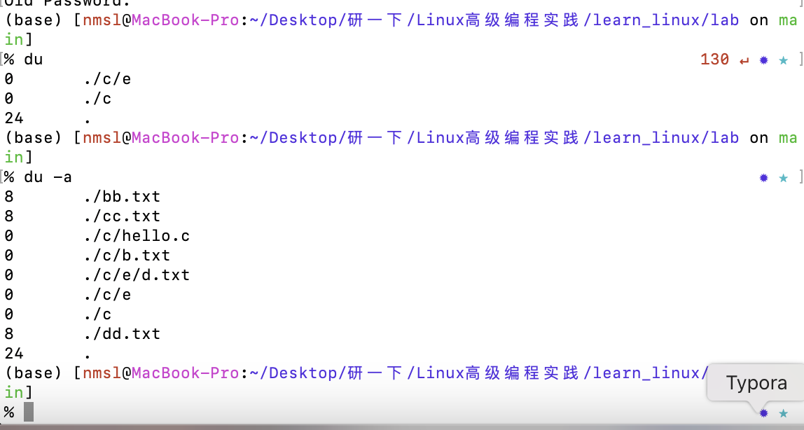
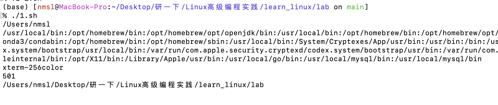
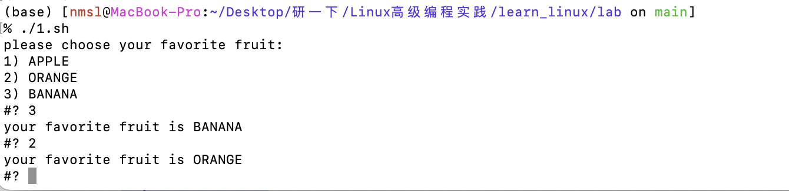

- [第1章代码](#第1章代码)
  - [1.4.2 Linux常用命令](#142-linux常用命令)
  - [1.5 VI编辑器的使用](#15-vi编辑器的使用)
- [第3章代码](#第3章代码)
  - [3.2 Bash编程](#32-bash编程)
  - [3.3 Shell中的特殊字符](#33-shell中的特殊字符)
  - [3.4 Shell变量](#34-shell变量)
  - [3.5 Shell控制语句](#35-shell控制语句)
  - [3.6 Shell其他命令](#36-shell其他命令)
  - [3.7 Shell函数](#37-shell函数)
  - [3.8 Shell数组](#38-shell数组)
  - [3.9 Shell中Dialog工具](#39-shell中dialog工具)


*以下内容白色背景部分是在macOS上执行，黑色背景部分则在ubuntu上执行。（部分内容macOS无法执行，故更换环境进行实践）*

*原教材部分代码有错，无法顺利运行，以下是经过矫正并顺利测试的代码及其运行结果。

*简单的代码不进行注释，放在前面。后面为带有中文注释的进阶代码。

### 第1章代码

#### 1.4.2 Linux常用命令
1. **man命令**：
   
   ```bash
   man man
   man write
   man 2 write
   man -a write
   man -k write
   ```
   
   
   
   
   
   
   
   
   
   
   
   
2. **info命令**：
   
   ```bash
   info gcc
   ```
   
   
   
3. **ls命令**：
   
   ```bash
   ls -l c*
   ls -al
   ```
   
   
   
   
   
4. **pwd命令**：
   ```bash
   pwd
   ```

   
   
5. **cd命令**：
   
   ```bash
   cd /usr/bin
   cd ~
   cd -
   ```

   
   
6. **mkdir和rmdir命令**：
   ```bash
   mkdir -p linux/doc/fedora/
   rmdir -p linux/doc/fedora/
   ```

   
   
7. **rm命令**：
   
   ```bash
   rm -i fedora.c
   rm -ir mydir
   rm -rf mydir
   ```
   
   
   
   
   
8. **mv命令**：
   ```bash
   mv netscape /usr
   mv netscape nets
   mv netscape /usr/nets
   ```

   
   
9. **cp命令**：
   ```bash
   cp /mydir/* /tmp
   cp -i /mydir/* /tmp
   ```

   
   
10. **cat命令**：
    ```bash
    cat -n /etc/profile
    cat file1 file2 > file3
    ```

   

11. **more命令**：
    ```bash
    more /etc/profile
    ```

   

12. **less命令**：
    ```bash
    less /etc/profile
    ```

   

13. **find命令**：
    ```bash
    find . -name "*.c"
    find . -name "*.c" -exec ls -l {} \;
    ```

   

14. **grep命令**：
    ```bash
    grep printf 2.6.c
    grep -v -n printf 2.6.c
    ```

   

15. **shutdown命令**：
    ```bash
    shutdown -h now
    ```

直接关机了   

16. **date命令**：
    ```bash
    date
    ```

   

17. **who命令**：
    ```bash
    who
    ```

   

18. **chmod命令**：
    
    ```bash
    chmod a+w a.txt
    chmod o-w a.txt
    chmod 777 a.txt
    ```

   

19. **chown命令**：
    ```bash
    chown root aa.c
    ```

   

20. **passwd命令**：
    
    ```bash
    passwd
    ```

   

21. **du命令**：
    ```bash
    du
    du -a
    ```

   

22. **df命令**：
    ```bash
    df
    df -k
    ```

   

23. **ps命令**：
    ```bash
    ps aux
    ```

   

24. **kill命令**：
    ```bash
    kill -9 PID
    kill -l
    ```


25. **pstree命令**：
    ```bash
    pstree
    ```

   

26. **cron命令**：
    ```bash
    /sbin/service crond start
    /sbin/service crond stop
    /sbin/service crond restart
    /sbin/service crond reload
    ```

   

27. **at命令**：
    
    ```bash
    at 5pm+3 days
    at 17:20 tomorrow
    atq
    atrm 7
    at -c 8
    ```

   

#### 1.5 VI编辑器的使用

1. **VI基本命令**：
   
   ```bash
   vi c.txt
   :wq
   ```
   
   
   
2. **光标移动**：
   ```bash
   j
   k
   h
   l
   ctrl+h
   ctrl+f
   Up
   Down
   Left
   Right
   G
   w
   b
   ```

   
   
3. **文本删除**：
   ```bash
   x
   #x
   dd
   dw
   #dd
   X
   D
   ```

   
   
4. **文本更改**：
   ```bash
   cw
   c#w
   cc
   C
   ```

   
   
5. **文本插入**：
   ```bash
   i
   a
   I
   A
   o
   O
   s
   S
   ```

   
   
6. **文本复制**：
   ```bash
   yw
   p
   yy
   #yy
   ```

   
   
7. **恢复修改**：
   
   ```bash
   u
   ```
   
   
   
8. **可视模式**：
   
   ```bash
   v
   ```
   
   
   
9. **查找和替换**：
   
   ```bash
   /searchstring
   :1,$s/pattern1/pattern2/g
   :%s/xxx/yyy
   ```
   
   
   
   
   
10. **编辑多个文件**：
    
    ```bash
    vi file1 file2 file3
    :n
    :n!
    :r filename
    ```

   

### 第3章代码

#### 3.2 Bash编程
1. **第一个Shell程序**：
   ```bash
   #!/bin/bash
   message="hello world!"
   echo $message
   exit
   ```

   
   
#### 3.3 Shell中的特殊字符
1. **转义符**：
   ```bash
   echo #aabbccdd
   echo \#aabbccdd
   ```

   
   
2. **单引号**：
   ```bash
   string=hello
   echo $string
   echo '$string'
   ```

   
   
3. **双引号**：
   ```bash
   echo "*abc"
   echo "$string"
   echo "\string"
   echo "\#string"
   echo "\$string"
   ```

   
   
4. **命令替换符号**：
   ```bash
   string='pwd'
   echo $string
   B='cat A|grep 123'
   echo $(B)
   echo "$B"
   echo '$B'
   ```

   
   
#### 3.4 Shell变量
1. **用户变量定义**：
   ```bash
   s1=hello
   echo ${s1}world
   echo $s1world
   ```

   
   
2. **环境变量**：
   ```bash
   echo ${HOME}
   echo ${PATH}
   echo ${TERM}
   echo ${UID}
   echo ${PWD}
   echo ${PS1}
   echo ${PS2}
   echo ${IFS}
   ```

   
   
3. **内部变量**：
   ```bash
   echo $_
   echo $*
   echo $?
   echo $#
   echo $$
   echo $0
   echo $@
   ```

   
   
4. **参数扩展**：
   ```bash
   name=${username:-'whoami'}
   echo ${name}
   echo ${username}
   ```

   
   
5. **算术扩展**：
   ```bash
   x=0
   while [ "$x" -ne 5 ]; do
       echo $x
       x=$(($x+1))
   done
   ```

   
   
6. **条件表达式**：
   ```bash
   #!/bin/bash
   name=""  # 假设 name 为空
   
   [ -z "$name" ] && echo "name is null"
   [ -n "$name" ] && echo "name is not null"
   ```
   
   
   
7. **字符串操作**：
   
   ```bash
   #!/bin/bash
   set -x
   string2=abcABC123ABCabc
   echo ${#string2}
   expr length "$string2"
   expr "$string2" : '.*'
   ```
   
   
   
#### 3.5 Shell控制语句

1. **if语句**：
   ```bash
   #!/bin/bash
   
   # 检查是否提供了参数
   if [ -z "$1" ]; then
       echo "请提供一个数字作为参数。"
       exit 1
   fi
   
   # 检查参数是否为有效的整数
   if ! [[ "$1" =~ ^-?[0-9]+$ ]]; then
       echo "参数必须是一个整数。"
       exit 1
   fi
   
   # 将参数转换为整数
   a="$1"
   
   if [ "$a" -le 10 ]; then
       echo "a<=10"
   elif [ "$a" -le 20 ]; then
       echo "10<a<=20"
   else
       echo "a>20"
   fi
   
   ```
   
   
   
2. **case语句**：
   ```bash
   #!/bin/bash
   read number
   case $number in
       1|3|5|7|9) echo "odd number";;
       2|4|6|8|0) echo "even number";;
       *) echo "number is bigger than 9";;
   esac
   ```

   
   
3. **select语句**：
   ```bash
   #!/bin/bash
   echo "please choose your favorite fruit:"
   select fruit in "APPLE" "ORANGE" "BANANA"; do
       echo "your favorite fruit is $fruit";
   done
   ```

   
   
4. **until语句**：
   ```bash
   #!/bin/bash
   echo -n "please input your name: "
   read name
   until [ "$name" = "cosmos" ]; do
       echo -n "the name you input is wrong, please input again: "
       read name
   done
   echo "you have typed name:$name"
   ```

   
   
5. **while语句**：
   ```bash
   #!/bin/bash
   echo -n "please input your name: "
   read name
   while [ "$name" != "cosmos" ]; do
       echo -n "the name you input is wrong, please input again: "
       read name
   done
   echo "you have typed name:$name"
   ```

   
   
6. **for语句**：
   ```bash
   #!/bin/bash
   for number in 1 2 3 4 5 6 7 8; do
       echo "number is $number"
   done
   ```

   
   
#### 3.6 Shell其他命令
1. **管道命令**：
   ```bash
   cat /var/log/message | more
   ps aux | grep bash
   ```

   
   
2. **重定向命令**：
   ```bash
   ls -l for.sh >a.txt
   echo aaabbb >>a.txt
   echo cccddd >a.txt
   ```

   
   
3. **echo命令**：
   ```bash
   echo -n "please input your name: "
   echo -e "hello\nworld"
   ```

   
   
4. **shift命令**：
   
   ```bash
   #!/bin/bash
   for name in *; do
       echo "parameter is:$1"
       shift 1
   done
   ```
   
   
   
#### 3.7 Shell函数
1. **函数定义与调用**：
   ```bash
   #!/bin/bash
   
   # 定义一个函数 max，用于求三个数中的最大值
   function max() {
       # 检查参数数量是否为 3 个
       if [ $# -ne 3 ]; then
           echo "usage:max p1 p2 p3"  # 如果参数数量不对，输出用法提示
           exit 1  # 退出脚本，返回状态码 1
       fi
   
       # 初始化 max 为第一个参数
       max=$1
   
       # 比较第二个参数和当前 max 的大小
       if [ $max -lt $2 ]; then
           max=$2  # 如果第二个参数更大，更新 max
       fi
   
       # 比较第三个参数和当前 max 的大小
       if [ $max -lt $3 ]; then
           max=$3  # 如果第三个参数更大，更新 max
       fi
   
       # 返回最大值
       return $max
   }
   
   # 调用 max 函数，传入三个参数 1, 2, 3
   max 1 2 3
   
   # 输出最大值
   # $? 是上一条命令的返回值，即 max 函数的返回值
   echo "the max number of 1 2 3 is : $?"
   ```
   
   
   
#### 3.8 Shell数组

1. **数组定义与访问**：
   ```bash
   #!/bin/bash
   
   # 定义一个数组 array，包含 5 个元素
   array=(jerry tom alice keven julie)
   
   # 初始化索引变量 index 为 0
   index=0
   
   # 使用 while 循环遍历数组
   while [ $index -lt ${#array[@]} ]; do
       # 输出当前索引和对应的数组元素
       echo "array[$index]=${array[index]}"
   
       # 索引加 1，继续遍历下一个元素
       index=$(($index+1))
   done
   
   # 输出数组的所有元素
   echo "all array is ${array[*]}"
   
   # 向数组中添加新元素，索引为 10 和 20
   array[10]="hello"
   array[20]="world"
   
   # 输出数组中索引为 10 的元素
   echo "array2[10]=${array2[10]}"
   
   # 输出数组中索引为 15 的元素（未定义，输出为空）
   echo "array2[15]=${array2[15]}"
   
   # 输出数组中索引为 20 的元素
   echo "array2[20]=${array2[20]}"
   ```
   
   
   

#### 3.9 Shell中Dialog工具

1. **Dialog命令**：
   ```bash
   dialog --msgbox "hello world" 9 18
   dialog --textbox filename height width
   dialog --inputbox "please input username" 10 30 2>name
   dialog --menu "Choose one:" 10 30 3 1 red 2 green 3 blue
   ```

   
   
2. **Dialog实例**：
   
   ```bash
   #!/bin/bash
   # 初始化变量 name 为空字符串
   name=""
   # 使用 while 循环，直到用户输入的 name 为 "cosmos" 时才退出循环
   while [ "$name" != "cosmos" ]
   do
       # 使用 dialog 创建一个输入框，提示用户输入用户名
       # 输入框的高度为 10 行，宽度为 30 列
       # 用户输入的内容会被重定向到文件 name 中
       dialog --inputbox "please input username" 10 30 2>name
       
       # 从文件 name 中读取用户输入的内容，并赋值给变量 name
       name=$(cat name)
   done
   
   # 当用户输入的 name 为 "cosmos" 时，显示欢迎消息
   dialog --msgbox "Welcome to student info System" 10 20
   while true
   do
       # 使用 dialog 创建一个菜单，提示用户选择操作
       # 菜单的高度为 10 行，宽度为 40 列
       # 菜单选项包括：
       # 1. Add Student info
       # 2. delete Student info
       # 3. modify student information
       # 4. exit
       # 用户选择的结果会被重定向到文件 menu.txt 中
       dialog --menu "Choose your operation:" 10 40 4 1 "Add Student info" 2 "delete Student info" 3 "modify student information" 4 "exit" 2>menu.txt
       # 从文件 menu.txt 中读取用户选择的操作，并赋值给变量 menu
       menu=$(cat menu.txt)
   
       # 显示用户选择的操作
       dialog --msgbox "your choose is $menu" 10 20
       
       # 如果用户选择的是 4（exit），则退出脚本
       if [ "$menu" -eq 4 ]; then
           exit 0
       fi
   done
   ```
   
   
   
   
   
   
   
   
   
   

