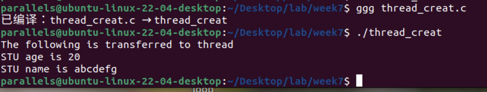
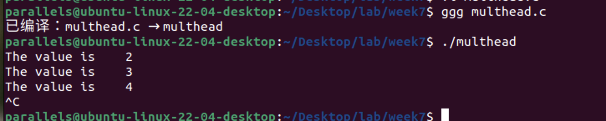
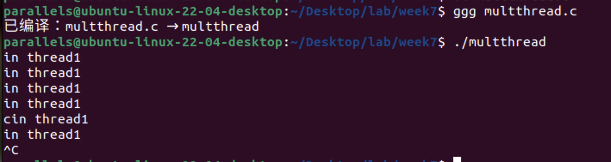
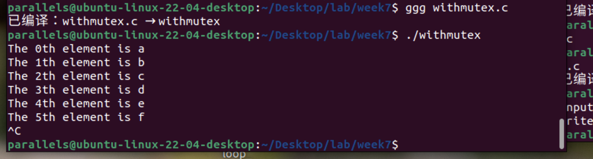
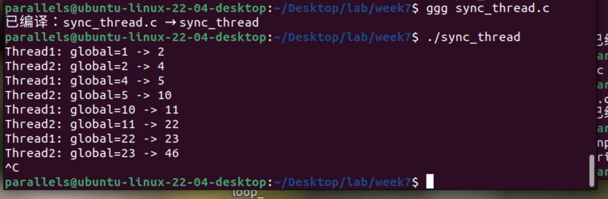
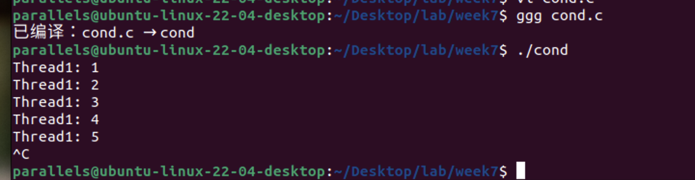

- [**例8-1：线程创建和参数传递**](#例8-1线程创建和参数传递)
- [**例8-2：多线程共享变量（需注意竞态条件）**](#例8-2多线程共享变量需注意竞态条件)
- [**例8-3：线程终止对比（pthread\_exit vs exit）**](#例8-3线程终止对比pthread_exit-vs-exit)
- [**例8-7：互斥量解决竞态问题**](#例8-7互斥量解决竞态问题)
- [**例8-8：信号量实现同步**](#例8-8信号量实现同步)
- [**例8-9：条件变量示例**](#例8-9条件变量示例)
  - [其他注意事项：](#其他注意事项)


整理第8章可执行代码片段后，实践效果如下：

---

### **例8-1：线程创建和参数传递**  
```c
/* thread_creat.c */
#include <pthread.h>
#include <stdio.h>
#include <stdlib.h>
#include <string.h>

typedef struct student {
    int age;
    char name[20];
} STU;

void *create(void *arg) {
    STU *temp = (STU *)arg;
    printf("The following is transferred to thread\n");
    printf("STU age is %d\n", temp->age);
    printf("STU name is %s\n", temp->name);
    return NULL; // 补充返回值
}

int main() {
    pthread_t tidp;
    STU *stu = malloc(sizeof(STU));
    stu->age = 20;
    strcpy(stu->name, "abcdefg");
    int error = pthread_create(&tidp, NULL, create, (void *)stu);
    if (error != 0) {
        printf("pthread_create failed\n");
        return -1;
    }
    pthread_join(tidp, NULL);
    free(stu); // 释放内存
    return 0;
}
```
**编译命令**：  
```bash
gcc -o thread_creat thread_creat.c -lpthread
```



---

### **例8-2：多线程共享变量（需注意竞态条件）**  
```c
/* multhead.c */
#include <pthread.h>
#include <stdio.h>
#include <unistd.h>

static int global = 1;

void *t1_execute(void *arg) {
    while (global < 100) {
        printf("The value is %4d\n", global);
        sleep(1); // 添加休眠避免忙等待
    }
    return NULL;
}

void *t2_execute(void *arg) {
    while (global < 100) {
        global++;
        sleep(1);
    }
    return NULL;
}

int main() {
    pthread_t pid1, pid2;
    pthread_create(&pid1, NULL, t1_execute, NULL);
    pthread_create(&pid2, NULL, t2_execute, NULL);
    pthread_join(pid1, NULL);
    pthread_join(pid2, NULL);
    return 0;
}
```
**编译命令**：  
```bash
gcc -o multhead multhead.c -lpthread
```



---

### **例8-3：线程终止对比（pthread_exit vs exit）**  
```c
/* multthread.c */
#include <pthread.h>
#include <stdio.h>
#include <stdlib.h>
#include <unistd.h>

void *t1_execute(void *arg) {
    while (1) {
        printf("in thread1\n");
        sleep(1);
    }
    return NULL;
}

void *t2_execute(void *arg) {
    sleep(2);
    pthread_exit(NULL); // 替换为 exit(0) 对比效果
}

int main() {
    pthread_t pid1, pid2;
    pthread_create(&pid1, NULL, t1_execute, NULL);
    pthread_create(&pid2, NULL, t2_execute, NULL);
    pthread_join(pid1, NULL);
    pthread_join(pid2, NULL);
    return 0;
}
```
**编译命令**：  

```bash
gcc -o multthread multthread.c -lpthread
```



---

### **例8-7：互斥量解决竞态问题**  
```c
/* withmutex.c */
#include <pthread.h>
#include <stdio.h>
#include <string.h>
#include <unistd.h>

char str[] = "abcdefghijklmnopqrstuvwxyz123456789";
pthread_mutex_t mutex;
int index2 = 0;

void *t1_exe(void *arg) {
    while (index2 < strlen(str) - 1) {
        pthread_mutex_lock(&mutex);
        printf("The %dth element is %c\n", index2, str[index2]);
        index2++;
        pthread_mutex_unlock(&mutex);
        sleep(1);
    }
    return NULL;
}

int main() {
    pthread_t pid1, pid2;
    pthread_mutex_init(&mutex, NULL);
    pthread_create(&pid1, NULL, t1_exe, NULL);
    pthread_create(&pid2, NULL, t1_exe, NULL); // 使用相同函数
    pthread_join(pid1, NULL);
    pthread_join(pid2, NULL);
    pthread_mutex_destroy(&mutex);
    return 0;
}
```
**编译命令**：  
```bash
gcc -o withmutex withmutex.c -lpthread
```



---

### **例8-8：信号量实现同步**  
```c
/* sync_thread.c */
#include <pthread.h>
#include <semaphore.h>
#include <stdio.h>
#include <unistd.h>

#define MAX 100
static sem_t sem1, sem2;
static int global = 1;

void *t1_exe(void *arg) {
    while (global < MAX) {
        sem_wait(&sem1);
        printf("Thread1: global=%d -> %d\n", global, global + 1);
        global++;
        sem_post(&sem2);
        sleep(1);
    }
    return NULL;
}

void *t2_exe(void *arg) {
    while (global < MAX) {
        sem_wait(&sem2);
        printf("Thread2: global=%d -> %d\n", global, global * 2);
        global *= 2;
        sem_post(&sem1);
        sleep(1);
    }
    return NULL;
}

int main() {
    sem_init(&sem1, 0, 1);
    sem_init(&sem2, 0, 0);
    pthread_t pid1, pid2;
    pthread_create(&pid1, NULL, t1_exe, NULL);
    pthread_create(&pid2, NULL, t2_exe, NULL);
    pthread_join(pid1, NULL);
    pthread_join(pid2, NULL);
    sem_destroy(&sem1);
    sem_destroy(&sem2);
    return 0;
}
```
**编译命令**：  
```bash
gcc -o sync_thread sync_thread.c -lpthread
```



---

### **例8-9：条件变量示例**

```c
/* cond.c */
#include <pthread.h>
#include <stdio.h>
#include <stdlib.h>
#include <unistd.h>

pthread_mutex_t mutex;  // 定义互斥锁
pthread_cond_t cond;    // 定义条件变量
int i = 1;              // 共享变量

void *thread1(void *arg) {
    for (i = 1; i <= 20; i++) {
        pthread_mutex_lock(&mutex);  // 加锁，保护共享变量i
        if (i % 9 == 0) {
            pthread_cond_signal(&cond);  // 如果i是9的倍数，发送条件信号
        } else {
            printf("Thread1: %d\n", i);  // 否则，打印i的值
        }
        pthread_mutex_unlock(&mutex);  // 解锁
        sleep(1);  // 休眠1秒，模拟耗时操作
    }
    return NULL;
}

void *thread2(void *arg) {
    pthread_mutex_lock(&mutex);  // 加锁，保护共享变量i
    while (i < 20) {  // 循环检查条件
        if (i % 9 != 0) {
            pthread_cond_wait(&cond, &mutex);  // 如果i不是9的倍数，等待条件信号
        }
        printf("Thread2: %d\n", i);  // 打印i的值
    }
    pthread_mutex_unlock(&mutex);  // 解锁
    return NULL;
}

int main() {
    pthread_mutex_init(&mutex, NULL);  // 初始化互斥锁
    pthread_cond_init(&cond, NULL);    // 初始化条件变量
    pthread_t t_a, t_b;                // 定义线程标识符
    pthread_create(&t_a, NULL, thread2, NULL);  // 创建线程2
    pthread_create(&t_b, NULL, thread1, NULL);  // 创建线程1
    pthread_join(t_a, NULL);  // 等待线程2结束
    pthread_join(t_b, NULL);  // 等待线程1结束
    pthread_mutex_destroy(&mutex);  // 销毁互斥锁
    pthread_cond_destroy(&cond);     // 销毁条件变量
    return 0;
}
```
**编译命令**：  
```bash
gcc -o cond cond.c -lpthread
```



---

#### 其他注意事项：

*所有代码均需通过 `-lpthread` 链接线程库。  

*运行示例时，可通过添加 `sleep` 调整输出顺序以便观察。  

*条件变量示例中，`thread2` 的循环逻辑可能需要进一步优化以避免死锁。

