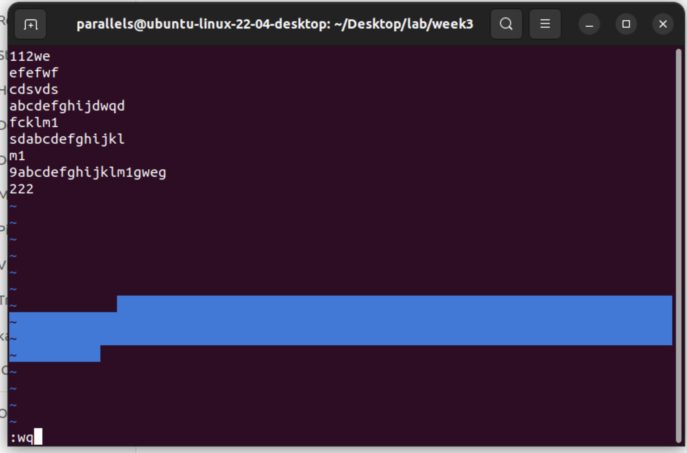
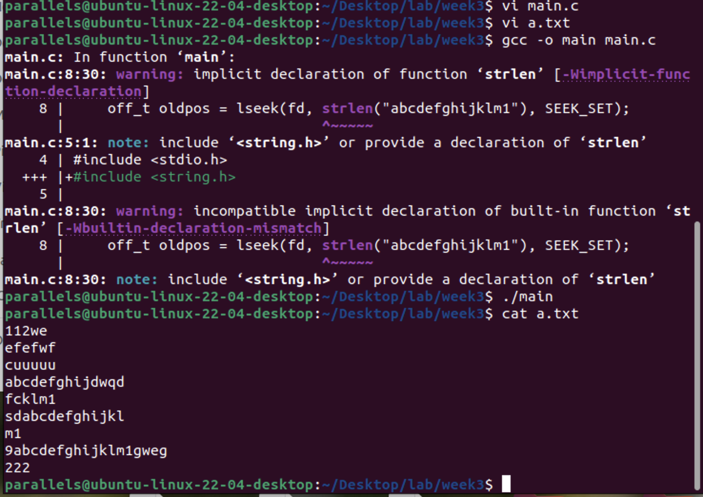
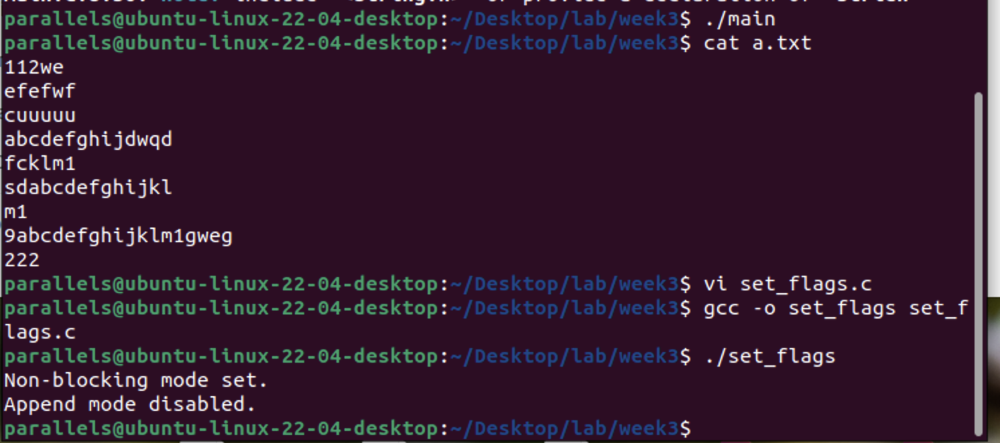
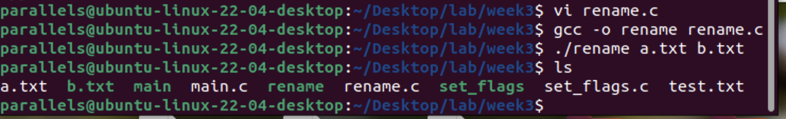
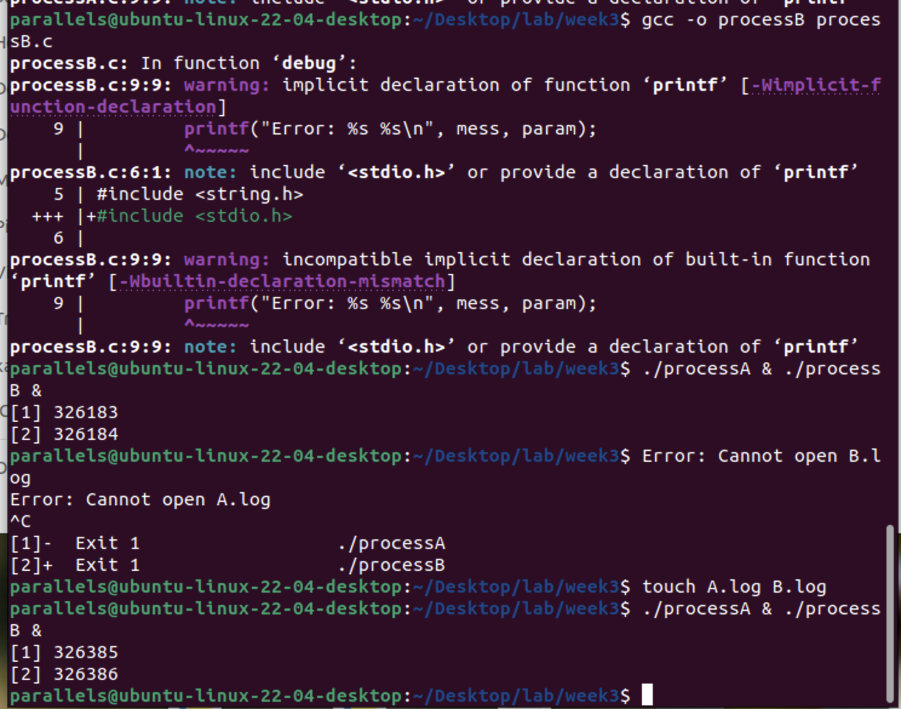
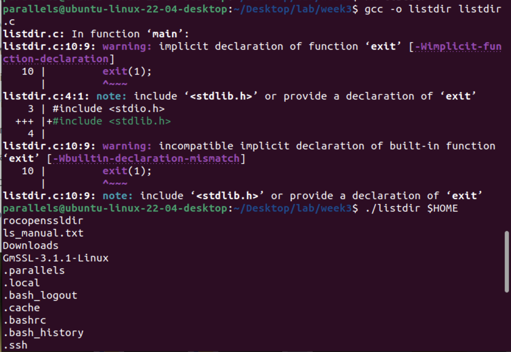
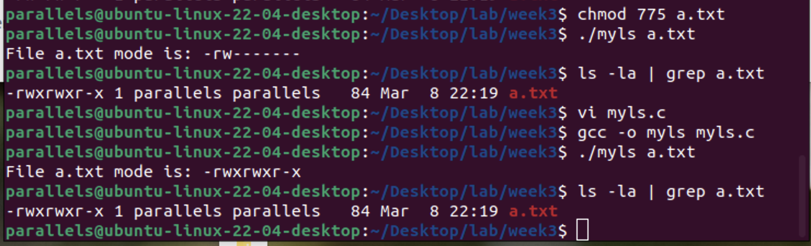

- [**1. 文件定位示例（例4-1）**](#1-文件定位示例例4-1)
- [**2. 文件描述符属性修改（4.2.6节）**](#2-文件描述符属性修改426节)
- [**3. 文件重命名程序（例4-4）**](#3-文件重命名程序例4-4)
- [**4. 多进程并发写入（例4-5）**](#4-多进程并发写入例4-5)
- [**5. 目录遍历（例4-8）**](#5-目录遍历例4-8)
- [**6. 文件属性读取（例4-9）**](#6-文件属性读取例4-9)


### **1. 文件定位示例（例4-1）**

```c
#include <sys/types.h>
#include <unistd.h>
#include <fcntl.h>
#include <stdio.h>

int main() {
    int fd = open("a.txt", O_RDWR);
    off_t oldpos = lseek(fd, strlen("abcdefghijklm1"), SEEK_SET);
    if (oldpos != -1) {
        int result = write(fd, "uuuuu", strlen("uuuuu"));
        if (result == -1) {
            printf("write error\n");
        }
    } else {
        printf("lseek error");
    }
    close(fd);
    return 0;
}
```
**功能**：通过 `lseek` 定位到文件指定位置并覆盖写入数据。  
**注意**：需确保文件 `a.txt` 存在，且包含足够内容。





---

### **2. 文件描述符属性修改（4.2.6节）**
```c
// 设置非阻塞模式
int flags = fcntl(fd, F_GETFL, 0);
flags |= O_NONBLOCK;
fcntl(fd, F_SETFL, flags);

// 取消追加模式
int flags = fcntl(fd, F_GETFL, 0);
flags &= ~O_APPEND;
fcntl(fd, F_SETFL, flags);
```
**功能**：动态修改文件描述符的阻塞/非阻塞、追加模式等属性。



---

### **3. 文件重命名程序（例4-4）**
```c
#include <stdio.h>
#include <stdlib.h>
#include <unistd.h>
#include <fcntl.h>
#define BUFFERSIZE 512

void debug(char *mess, char *param, int n) {
    if (n == -1) {
        printf("Error occurred: %s %s\n", mess, param);
        exit(1);
    }
}

int main(int ac, char **av) {
    int in_fd, out_fd, n_chars;
    char buf[BUFFERSIZE];
    if (ac != 3) {
        printf("Usage: %s source destination\n", av[0]);
        exit(1);
    }
    in_fd = open(av[1], O_RDONLY);
    debug("Cannot open", av[1], in_fd);
    out_fd = creat(av[2], 0744);
    debug("Cannot create", av[2], out_fd);
    while ((n_chars = read(in_fd, buf, BUFFERSIZE)) > 0) {
        if (write(out_fd, buf, n_chars) != n_chars) {
            debug("Write error to", av[2], -1);
        }
    }
    close(in_fd);
    close(out_fd);
    return 0;
}
```
**功能**：复制文件内容到新文件，实现文件重命名。  
**编译命令**：  
```bash
gcc -o rename rename.c
./rename a.txt b.txt
```



---

### **4. 多进程并发写入（例4-5）**
```c
// processA.c
#include <stdlib.h>
#include <unistd.h>
#include <fcntl.h>
#include <string.h>

void debug(char *mess, char *param, int n) {
    if (n == -1) {
        printf("Error: %s %s\n", mess, param);
        exit(1);
    }
}

int main() {
    int fd = open("A.log", O_WRONLY | O_APPEND); // 关键：使用 O_APPEND
    debug("Cannot open", "A.log", fd);
    sleep(10);
    int nwrite = write(fd, "AAAAAAAAAAAAAA", strlen("AAAAAAAAAAAAAA"));
    debug("Write error", "A.log", nwrite);
    close(fd);
    return 0;
}

// processB.c（与 processA.c 类似，写入内容为 "BBBBBBBBBB"）
```
**功能**：演示多进程并发追加写入文件，通过 `O_APPEND` 避免数据覆盖。  
**编译命令**：  
```bash
gcc -o processA processA.c
gcc -o processB processB.c
./processA & ./processB &
```



---

### **5. 目录遍历（例4-8）**
```c
#include <sys/types.h>
#include <dirent.h>
#include <stdio.h>

int main(int ac, char **av) {
    DIR *dir_ptr;
    struct dirent *dir;
    if (ac < 2) {
        printf("Usage: listdir directoryname\n");
        exit(1);
    }
    dir_ptr = opendir(av[1]);
    if (dir_ptr != NULL) {
        while ((dir = readdir(dir_ptr)) != NULL) {
            printf("%s\n", dir->d_name);
        }
        closedir(dir_ptr);
    }
    return 0;
}
```
**功能**：列出指定目录下的所有文件名。  
**编译命令**：  
```bash
gcc -o listdir listdir.c
./listdir /path/to/directory
```



---

### **6. 文件属性读取（例4-9）**

```c
#include <sys/stat.h>
#include <stdio.h>
#include <string.h>  // 添加 string.h 头文件以使用 strcpy

void mode_to_letter(mode_t mode, char *str) {
    strcpy(str, "----------");

    // 文件类型
    if (S_ISDIR(mode)) str[0] = 'd';  // 目录
    if (S_ISCHR(mode)) str[0] = 'c';  // 字符设备
    if (S_ISBLK(mode)) str[0] = 'b';  // 块设备
    if (S_ISFIFO(mode)) str[0] = 'p'; // 管道
    if (S_ISLNK(mode)) str[0] = 'l';  // 符号链接
    if (S_ISSOCK(mode)) str[0] = 's'; // 套接字

    // 用户权限
    if (mode & S_IRUSR) str[1] = 'r'; // 用户读
    if (mode & S_IWUSR) str[2] = 'w'; // 用户写
    if (mode & S_IXUSR) str[3] = 'x'; // 用户执行

    // 组权限
    if (mode & S_IRGRP) str[4] = 'r'; // 组读
    if (mode & S_IWGRP) str[5] = 'w'; // 组写
    if (mode & S_IXGRP) str[6] = 'x'; // 组执行

    // 其他用户权限
    if (mode & S_IROTH) str[7] = 'r'; // 其他用户读
    if (mode & S_IWOTH) str[8] = 'w'; // 其他用户写
    if (mode & S_IXOTH) str[9] = 'x'; // 其他用户执行
}

int main(int argc, char **argv) {
    if (argc < 2) {
        printf("Usage: %s <filename>\n", argv[0]);
        return 1;
    }

    struct stat attr;
    char mode[11];
    if (stat(argv[1], &attr) != -1) {
        mode_to_letter(attr.st_mode, mode);
        printf("File %s mode is: %s\n", argv[1], mode);
    } else {
        printf("Stat error\n");
    }
    return 0;
}
```
**功能**：将文件的 `st_mode` 转换为可读的权限字符串。  
**编译命令**：  

```bash
gcc -o myls myls.c
./myls filename
```


