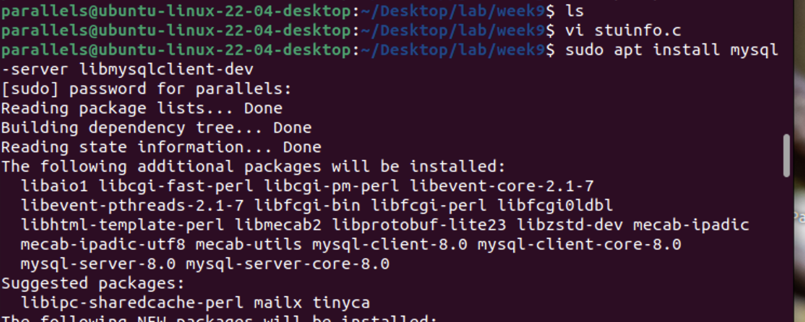
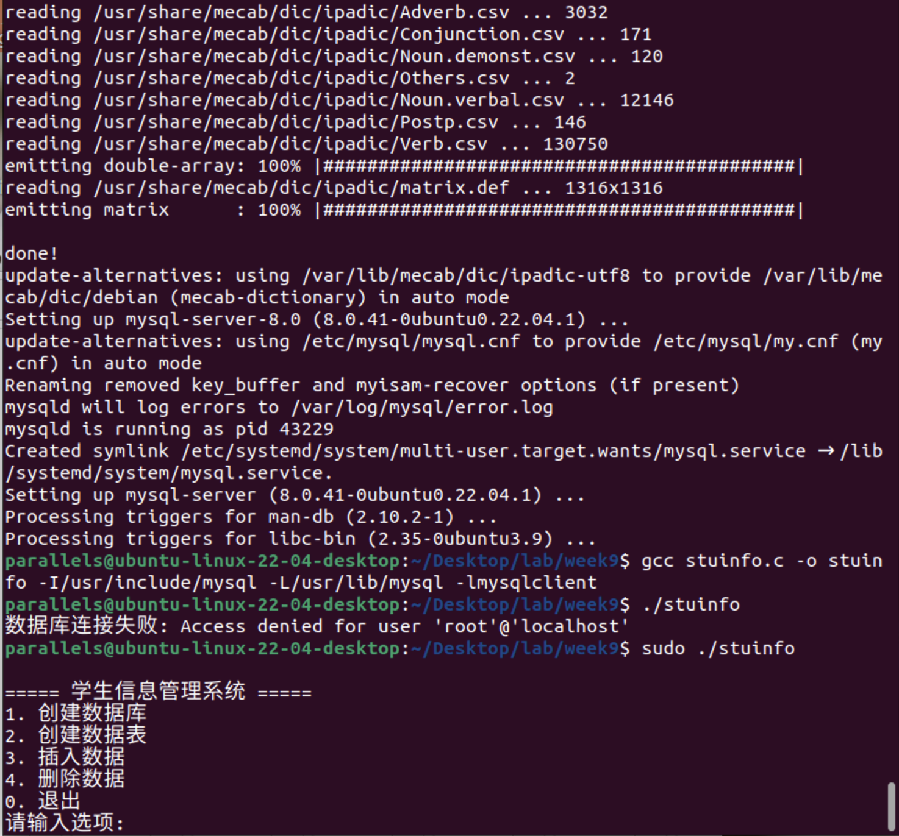
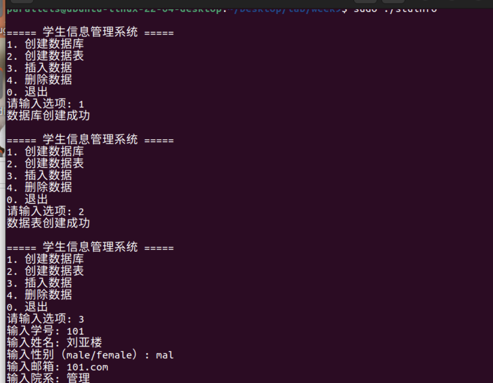
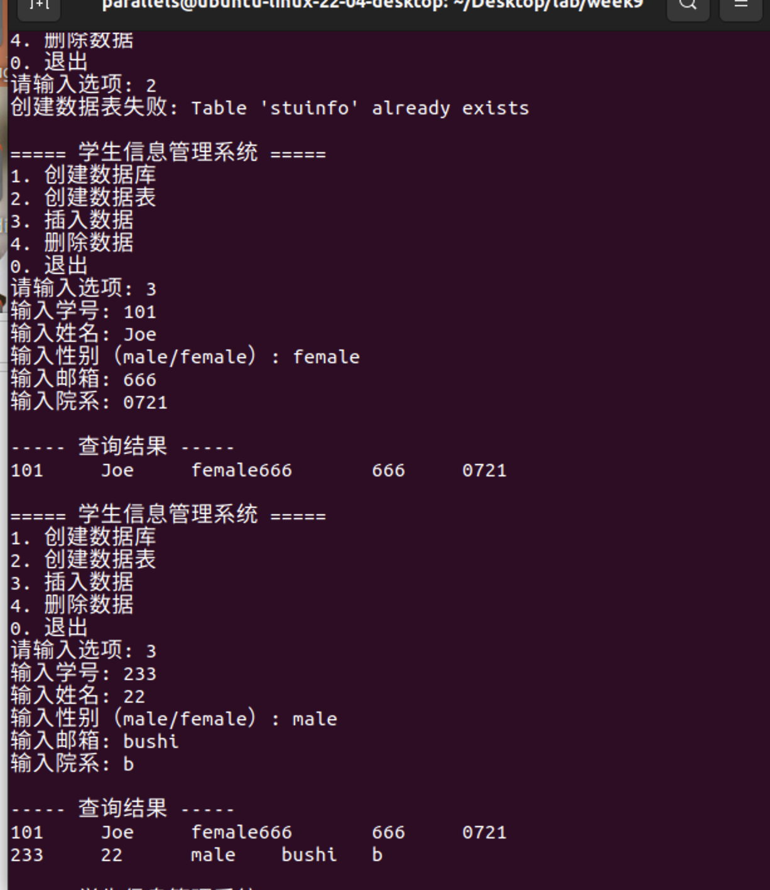

- [**编译与运行说明**](#编译与运行说明)
- [**注意事项**](#注意事项)
  - [其他注意事项：](#其他注意事项)


整理第10章可执行代码片段后，实践效果如下：

---

```c
/* stuinfo.c - 学生信息管理系统完整代码 */
#include "mysql.h"
#include <stdio.h>
#include <stdlib.h>
#include <string.h>

// 学生信息结构体（对应数据库表结构）
struct student {
    int id;
    char name[20];
    char sex[6];
    char mailbox[40];
    char studep[100];
};

/*------------ 数据库初始化与连接 ------------*/
MYSQL* initial(MYSQL *con) {
    if (mysql_library_init(0, NULL, NULL)) {
        fprintf(stderr, "MySQL库初始化失败\n");
        return NULL;
    }
    con = mysql_init(NULL);
    return con;
}

MYSQL* myconnect(MYSQL *con, char *db) {
    if (!mysql_real_connect(con, "localhost", "root", "root", db, 0, NULL, 0)) {
        fprintf(stderr, "数据库连接失败: %s\n", mysql_error(con));
        return NULL;
    }
    return con;
}

/*------------ 数据库操作函数 ------------*/
void createDB(MYSQL *con, char *cmd) {
    if (mysql_query(con, cmd)) {
        fprintf(stderr, "创建数据库失败: %s\n", mysql_error(con));
    } else {
        printf("数据库创建成功\n");
    }
}

void createTable(MYSQL *con, char *db, char *cmd) {
    if (mysql_select_db(con, db)) {
        fprintf(stderr, "选择数据库失败: %s\n", mysql_error(con));
        return;
    }
    if (mysql_query(con, cmd)) {
        fprintf(stderr, "创建数据表失败: %s\n", mysql_error(con));
    } else {
        printf("数据表创建成功\n");
    }
}

/*------------ 数据查询与展示 ------------*/
void displayTable(MYSQL *con, char *query) {
    MYSQL_RES *result = mysql_store_result(con);
    if (!result) {
        fprintf(stderr, "获取结果集失败: %s\n", mysql_error(con));
        return;
    }

    int num_fields = mysql_num_fields(result);
    MYSQL_ROW row;

    printf("\n----- 查询结果 -----\n");
    while ((row = mysql_fetch_row(result))) {
        for (int i = 0; i < num_fields; i++) {
            printf("%s\t", row[i] ? row[i] : "NULL");
        }
        printf("\n");
    }
    mysql_free_result(result);
}

/*------------ 数据插入与删除 ------------*/
void insertData(MYSQL *con) {
    struct student s;
    char query[1024];

    printf("输入学号: ");
    scanf("%d", &s.id);
    printf("输入姓名: ");
    scanf("%s", s.name);
    printf("输入性别（male/female）: ");
    scanf("%s", s.sex);
    printf("输入邮箱: ");
    scanf("%s", s.mailbox);
    printf("输入院系: ");
    scanf("%s", s.studep);

    sprintf(query, "INSERT INTO stuinfo VALUES(%d, '%s', '%s', '%s', '%s')", 
            s.id, s.name, s.sex, s.mailbox, s.studep);

    if (mysql_query(con, query)) {
        mysql_rollback(con);
        fprintf(stderr, "插入失败: %s\n", mysql_error(con));
    } else {
        mysql_commit(con);
        displayTable(con, "SELECT * FROM stuinfo");
    }
}

void deleteData(MYSQL *con) {
    int id;
    char query[64];
    printf("输入要删除的学号: ");
    scanf("%d", &id);

    sprintf(query, "DELETE FROM stuinfo WHERE id=%d", id);
    if (mysql_query(con, query)) {
        mysql_rollback(con);
        fprintf(stderr, "删除失败: %s\n", mysql_error(con));
    } else {
        mysql_commit(con);
        printf("删除成功\n");
        displayTable(con, "SELECT * FROM stuinfo");
    }
}

/*------------ 菜单驱动逻辑 ------------*/
int menu() {
    int choice;
    printf("\n===== 学生信息管理系统 =====\n");
    printf("1. 创建数据库\n");
    printf("2. 创建数据表\n");
    printf("3. 插入数据\n");
    printf("4. 删除数据\n");
    printf("0. 退出\n");
    printf("请输入选项: ");
    scanf("%d", &choice);
    return choice;
}

int main() {
    MYSQL *con = initial(NULL);
    if (!con) exit(1);

    if (!myconnect(con, "")) exit(1);

    int choice;
    while ((choice = menu()) != 0) {
        switch (choice) {
            case 1:
                createDB(con, "CREATE DATABASE student");
                break;
            case 2:
                createTable(con, "student", 
                    "CREATE TABLE stuinfo(id INT, stuname TEXT, gender TEXT, mailbox TEXT, studep TEXT)");
                break;
            case 3:
                insertData(con);
                break;
            case 4:
                deleteData(con);
                break;
            default:
                printf("无效选项\n");
        }
    }

    mysql_close(con);
    mysql_library_end();
    return 0;
}
```

---

### **编译与运行说明**
1. **依赖安装**  
   ```bash
   # Ubuntu/Debian
   sudo apt install mysql-server libmysqlclient-dev
   ```

2. **编译命令**  
   ```bash
   gcc stuinfo.c -o stuinfo -I/usr/include/mysql -L/usr/lib/mysql -lmysqlclient
   ```

3. **运行步骤**  
   - 启动MySQL服务：`sudo systemctl start mysql`
   - 运行程序：`./stuinfo`
   - 按菜单选项操作（需提前用root用户密码登录）。









---

### **注意事项**

1. **数据库配置**：代码中默认使用`root`用户和密码`root`，需与实际MySQL配置一致。
2. **SQL注入风险**：示例未使用预处理语句，实际开发应使用`mysql_stmt_prepare()`防范注入。
3. **错误处理**：所有数据库操作后应检查返回值，确保资源释放（如`mysql_free_result()`）。

#### 其他注意事项：

*所有代码均需通过 `-lpthread` 链接线程库。  

*运行示例时，可通过添加 `sleep` 调整输出顺序以便观察。  

*条件变量示例中，`thread2` 的循环逻辑可能需要进一步优化以避免死锁。
