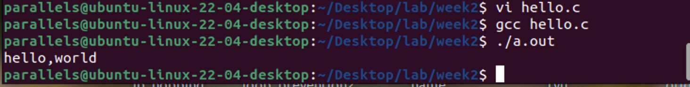

以下是第2章中的可执行代码片段：

### 2.1 GCC 编译器的使用

#### 例 2-1: 编写并编译一个简单的 C 程序
```c
#include <stdio.h>
void main()
{
    printf("hello,world\n");
}
```
编译并执行：
```bash
gcc hello.c
./a.out
```



#### 例 2-2: 使用 GCC 的 -D 选项

```c
#include <stdio.h>
void main()
{
    int arr[10], i = 0;
    for (i = 0; i < 10; i++)
    {
        arr[i] = i;
        if (DEBUG) // 使用了一个名为 DEBUG 的宏，该宏在编译的时候定义
        {
            printf("arr[%d]=%d\n", i, arr[i]);
        }
    }
}
```
编译并执行：
```bash
gcc -DDEBUG -o debug debug.c
./debug
```


#### 例 2-3: GCC 的预处理及编译过程

```c
#include <stdio.h>
#define sum(a, b) a + b
void main()
{
    int num = sum(1, 2);
    printf("num=%d\n", num);
}
```
预处理：
```bash
gcc -E -o test.i test.c
```
生成汇编代码：
```bash
gcc -S -o test.s test.c
```
生成目标文件：
```bash
gcc -c -o test.o test.s
```
链接并生成可执行文件：
```bash
gcc -o test test.o
./test
```


### 2.1.6 利用 GCC 创建库文件

#### 例 2-5: 创建静态库
```c
// calc.h
double aver(double, double);
double sum(double, double);

// aver.c
#include "calc.h"
double aver(double num1, double num2)
{
    return (num1 + num2) / 2;
}

// sum.c
#include "calc.h"
double sum(double num1, double num2)
{
    return num1 + num2;
}

// main.c
#include <stdio.h>
#include "calc.h"
int main(int argc, char* argv[]) {
    double v1, v2, m, sum2;
    v1 = 3.2;
    v2 = 8.9;
    m = aver(v1, v2);
    sum2 = sum(v1, v2);
    printf("The mean of %3.2f and %3.2f is %3.2f\n", v1, v2, m);
    printf("The sum of %3.2f and %3.2f is %3.2f\n", v1, v2, sum2);
    return 0;
}
```
编译并生成静态库：
```bash
gcc -c -o aver.o aver.c
gcc -c -o sum.o sum.c
ar rc libmycalc.a aver.o sum.o
```
编译主程序并链接静态库：
```bash
gcc main.c -Bstatic -L. -lmycalc -o static-main
./static-main
```


#### 例 2-6: 创建动态库

生成目标文件：
```bash
gcc -c -fPIC aver.c -o aver.o
gcc -c -fPIC sum.c -o sum.o
```
生成共享库：
```bash
gcc -shared libmycalc.so aver.o sum.o
```
编译主程序并链接共享库：
```bash
gcc main.c -L. -lmycalc -o shared-main
export LD_LIBRARY_PATH=.
./shared-main
```


### 2.2 GDB 调试器的使用

#### 例 2-7: GDB 调试示例
```c
#include <stdio.h>
void debug(char *str)
{
    printf("debug information: %s\n", str);
}
main()
{
    int i, j;
    j = 0;
    for (i = 0; i < 10; i++)
    {
        j += 5;
        printf("now a=%d\n", j);
        debug("xxxxxxxxxxxxx");
    }
}
```
编译并调试：
```bash
gcc -g -o exam example.c
gdb exam
```
在 GDB 中使用以下命令进行调试：
```bash
break 10  # 在第10行设置断点
run       # 运行程序
list      # 查看代码
step      # 单步执行
print j   # 打印变量j的值
continue  # 继续执行
```


### 2.3 Make 工具

#### 例 2-10: 第一个 Makefile 文件

```makefile
# Makefile
main: main.o hello1.o hello2.o
    gcc -o main main.o hello1.o hello2.o
main.o: main.c hello1.h hello2.h
    gcc -c main.c
hello1.o: hello1.c hello1.h
    gcc -c hello1.c
hello2.o: hello2.c hello2.h
    gcc -c hello2.c
clean:
    rm main hello1.o hello2.o main.o
```
编译并执行：
```bash
make
./main
```


### 2.3.4 Makefile 文件

#### 例 2-11: Dr.com Linux 版本的 Makefile

```makefile
# 主 Makefile
TOPSRCDIR = $(shell pwd)
DESTDIR = /usr/local/bin/
export TOPSRCDIR DESTDIR
SUBDIRS = droomc droomd kmod
.PHONY: all clean install
all:
    @for x in $(SUBDIRS); do (cd $$x && make all) || exit 1; done
clean:
    @for x in $(SUBDIRS); do (cd $$x && make clean) || exit 1; done
install:
    @for x in $(SUBDIRS); do (cd $$x && make install) || exit 1; done
    @echo
    @echo
    @if [ -a /etc/droom.conf ]; then \
        echo "========================" && \
        echo "" && \
        echo "/etc/droom.conf exists."; \
        echo "" && \
        echo "You May Need to Edit /etc/droom.conf" && \
        echo "" && \
        echo "========================" \
    ; \
    else \
        install -m 600 droom.conf /etc/droom.conf && \
        echo "========================" && \
        echo "" && \
        echo "Do Not Forget To Edit /etc/droom.conf" && \
        echo "" && \
        echo "========================" \
    ; \
    fi
    @echo
```

这些代码片段涵盖了第2章中的主要编程实践内容，你可以根据这些代码进行练习和调试。


