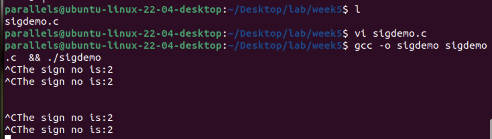
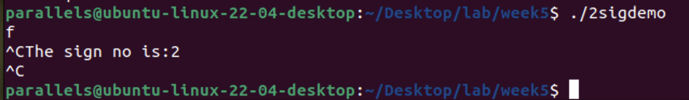
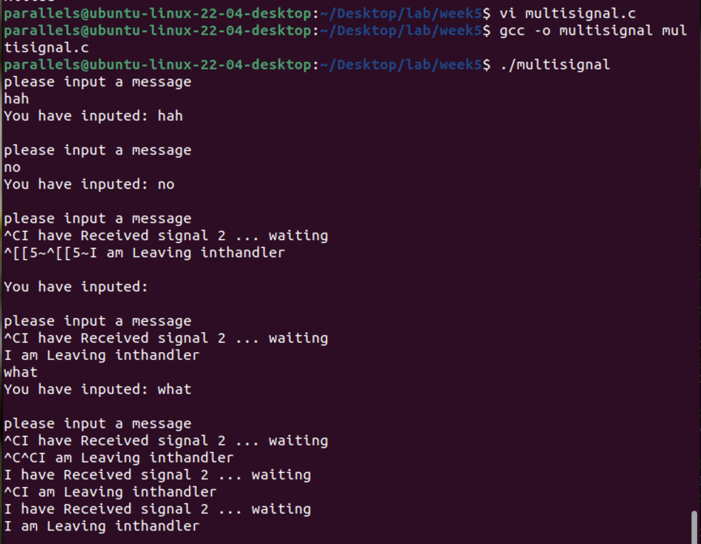
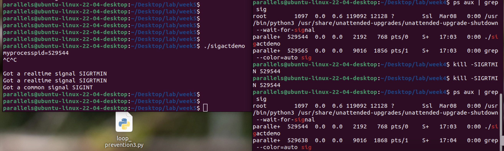
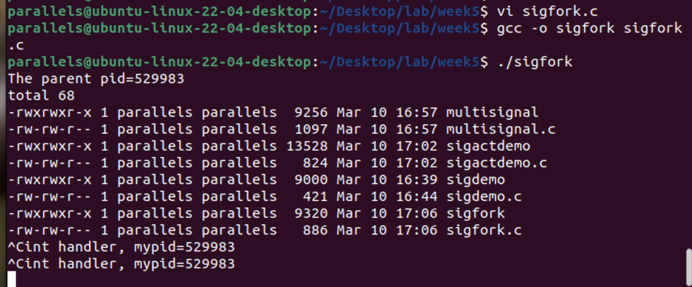
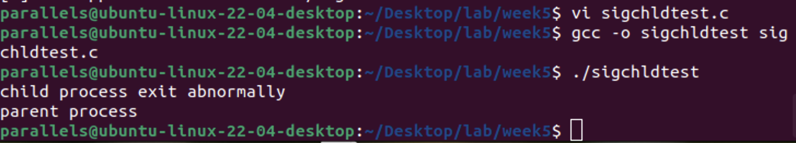
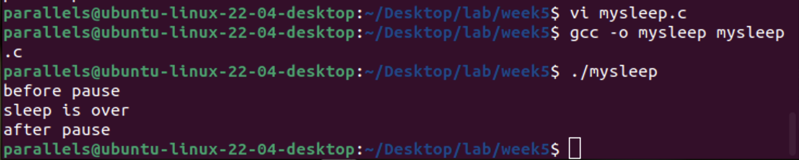
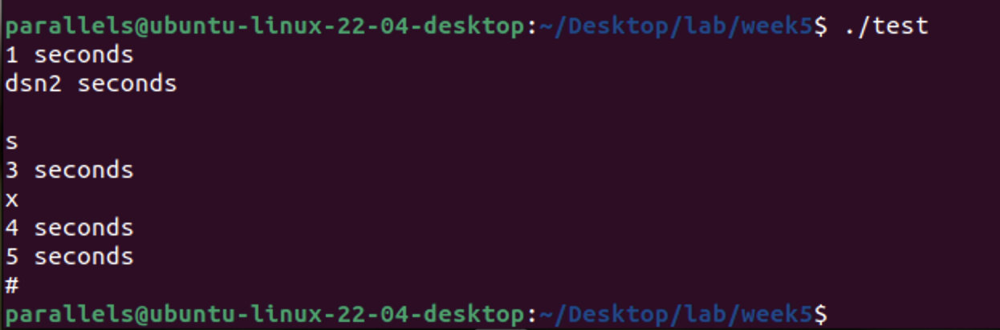

- [例6-1：sigdemo.c](#例6-1sigdemoc)
- [例6-2：multisignal.c](#例6-2multisignalc)
- [例6-3：sigactdemo.c](#例6-3sigactdemoc)
- [例6-4：sigfork.c](#例6-4sigforkc)
- [例6-5：sigchldtest.c](#例6-5sigchldtestc)
- [例6-6：mysleep.c](#例6-6mysleepc)
- [定时器示例代码](#定时器示例代码)
  - [其他注意事项：](#其他注意事项)

整理第6章可执行代码片段后，实践效果如下：

---

### 例6-1：sigdemo.c
```c
#include <unistd.h>
#include <stdio.h>
#include <signal.h>
#include <sys/types.h>

void sigHandler(int signalNum) {
    printf("The sign no is:%d\n", signalNum);
}

int main() {
    signal(SIGINT, sigHandler);        // 处理Ctrl+C信号
    signal(SIGQUIT, SIG_IGN);          // 忽略Ctrl+\信号
    while(1) {                         // 改为while(1)避免依赖stdbool.h
        sleep(1);
    }
    return 0;
}
```



可见，由于系统不同，教材源代码使用二次ctrl+C并不能退出程序。下面改进代码后重试：

```c
#include <signal.h>

void sigHandler(int signalNum) {
    printf("The sign no is:%d\n", signalNum);
}

int main() {
    struct sigaction sa;
    sa.sa_handler = sigHandler;
    sigemptyset(&sa.sa_mask);
    sa.sa_flags = SA_RESETHAND; // 关键：处理完信号后恢复默认行为

    sigaction(SIGINT, &sa, NULL);
    signal(SIGQUIT, SIG_IGN);

    while(1) {
        sleep(1);
    }
    return 0;
}
```



效果拔群。

---

### 例6-2：multisignal.c

```c
#include <unistd.h>
#include <stdio.h>
#include <sys/types.h>
#include <signal.h>
#include <string.h>                   // 添加strncmp依赖的头文件

#define INPUTLEN 20
char input[INPUTLEN];

void inthandler(int s) {
    printf("I have Received signal %d ... waiting\n", s);
    sleep(2);
    printf("I am Leaving inthandler \n");
    signal(SIGINT, inthandler);       // 重新注册信号处理函数
}

void quithandler(int s) {
    printf("I have Received signal %d ... waiting\n", s);
    sleep(3);
    printf("I am Leaving quithandler \n");
    signal(SIGQUIT, quithandler);
}

int main() {                          // 修正main函数返回类型为int
    signal(SIGINT, inthandler);
    signal(SIGQUIT, quithandler);
    int nchars;
    do {
        printf("please input a message\n");
        nchars = read(0, input, INPUTLEN-1);
        if (nchars == -1) {
            perror("read returned an error");
        } else {
            input[nchars] = '\0';
            printf("You have inputed: %s\n", input);
        }
    } while (strncmp(input, "quit", 4) != 0);
    return 0;
}
```



---

### 例6-3：sigactdemo.c

```c
#include <stdio.h>
#include <string.h>
#include <signal.h>
#include <unistd.h>

void sig_handler(int signum, siginfo_t* info, void* myact) {
    if (signum == SIGINT)
        printf("Got a common signal SIGINT\n");
    else
        printf("Got a realtime signal SIGRTMIN\n");
}

int main() {
    struct sigaction act;
    sigset_t newmask, oldmask;
    sigemptyset(&newmask);
    sigaddset(&newmask, SIGINT);
    sigaddset(&newmask, SIGRTMIN);
    sigprocmask(SIG_BLOCK, &newmask, &oldmask);

    act.sa_sigaction = sig_handler;
    act.sa_flags = SA_SIGINFO;
    if (sigaction(SIGINT, &act, NULL) < 0 || sigaction(SIGRTMIN, &act, NULL) < 0) {
        perror("sigaction error");
        return 1;
    }

    printf("myprocesspid=%d\n", getpid());
    sleep(60);
    sigprocmask(SIG_SETMASK, &oldmask, NULL);
    return 0;
}
```



---

### 例6-4：sigfork.c

```c
#include <stdio.h>
#include <string.h>
#include <signal.h>
#include <unistd.h>
#include <stdlib.h>                   // 添加exit依赖的头文件

void intsig_handler(int signumber, siginfo_t* siginfo, void* empty) {
    printf("int handler, mypid=%d\n", getpid());
}

int main() {
    int pid;
    char* arg[] = {"ls", "-l", NULL}; // 修正execvp参数
    struct sigaction act;
    act.sa_sigaction = intsig_handler;
    act.sa_flags = SA_SIGINFO;

    if (sigaction(SIGINT, &act, NULL) < 0) {
        perror("install signal error");
        return 1;
    }

    printf("The parent pid=%d\n", getpid());
    pid = fork();
    if (pid < 0) {
        perror("fork failed!\n");
        exit(1);
    } else if (pid == 0) {
        execvp("ls", arg);           // 子进程执行ls命令
    } else {
        while(1);                    // 父进程无限循环
    }
    return 0;
}
```



---

### 例6-5：sigchldtest.c

```c
#include <stdio.h>
#include <signal.h>
#include <unistd.h>
#include <sys/wait.h>
#include <stdlib.h>
#include <sys/types.h>

void sigchild_handler(int sig) {
    int status;
    waitpid(-1, &status, WNOHANG);
    if (WIFEXITED(status))
        printf("child process exit normally\n");
    else if (WIFSIGNALED(status))
        printf("child process exit abnormally\n");
    else if (WIFSTOPPED(status))
        printf("child process is stopped\n");
    else
        printf("unknown status\n");
}

int main() {
    pid_t pid;
    signal(SIGCHLD, sigchild_handler);
    pid = fork();
    if (pid == 0) {
        abort();                     // 子进程异常退出
    } else if (pid > 0) {
        sleep(2);
        printf("parent process\n");
    } else {
        exit(1);
    }
    return 0;
}
```



---

### 例6-6：mysleep.c
```c
#include <signal.h>
#include <stdio.h>
#include <unistd.h>

void alarm_handler(int sig) {
    printf("sleep is over\n");
}

void mysleep(int seconds) {
    signal(SIGALRM, alarm_handler);
    alarm(seconds);
    pause();
}

int main() {
    printf("before pause\n");
    mysleep(3);
    printf("after pause\n");
    return 0;
}
```



---

### 定时器示例代码

```c
#include <stdio.h>
#include <unistd.h>
#include <signal.h>
#include <sys/time.h>

int i = 0;

void alarmsign_handler(int SignNo) {
    printf("%d seconds\n", ++i);
}

int main() {
    signal(SIGALRM, alarmsign_handler);
    struct itimerval tval;

    // 初始间隔1秒，后续间隔1秒
    tval.it_value.tv_sec = 1;
    tval.it_value.tv_usec = 0;
    tval.it_interval.tv_sec = 1;
    tval.it_interval.tv_usec = 0;

    setitimer(ITIMER_REAL, &tval, NULL);
    while(getchar() != '#');          // 输入#结束程序
    return 0;
}
```



#### 其他注意事项：

*部分代码依赖实时信号（如`SIGRTMIN`），需确认系统支持。

*定时器代码中的`struct itimerval`需包含头文件`<sys/time.h>`。

