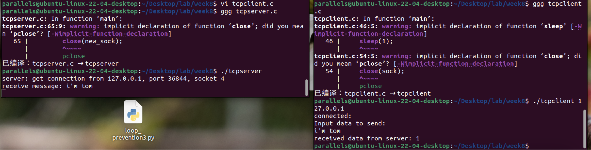
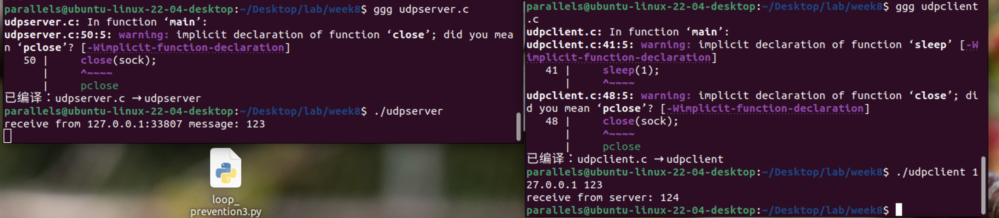
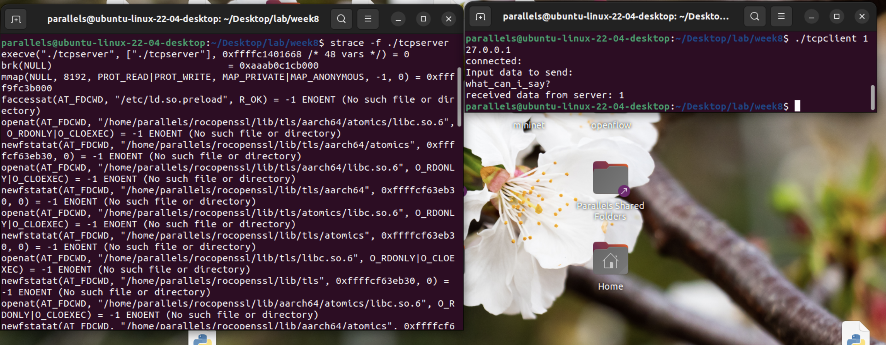
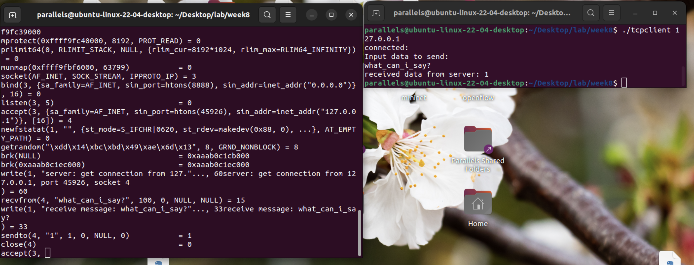
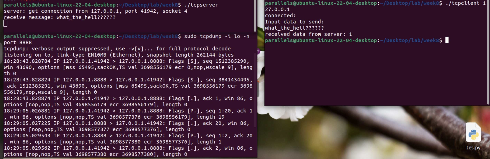

- [**TCP服务器/客户端示例**](#tcp服务器客户端示例)
  - [服务器端代码 (tcpserver.c)](#服务器端代码-tcpserverc)
  - [客户端代码 (tcpclient.c)](#客户端代码-tcpclientc)
- [**UDP服务器/客户端示例**](#udp服务器客户端示例)
  - [服务器端代码 (udpserver.c)](#服务器端代码-udpserverc)
  - [客户端代码 (udpclient.c)](#客户端代码-udpclientc)
  - [**其他注意事项**](#其他注意事项)

整理第9章可执行代码片段后，实践效果如下：

---

### **TCP服务器/客户端示例**

#### 服务器端代码 (tcpserver.c)
```c
#include <stdio.h>
#include <sys/socket.h>
#include <error.h>
#include <stdlib.h>
#include <string.h>
#include <sys/types.h>
#include <netinet/in.h>
#include <arpa/inet.h>
#define PORT 8888

int main() {
    int sock, new_sock;
    struct sockaddr_in my_addr, client_addr;
    int len;
    char buf[100];
    char buf2[128];
    int recdata = 0;

    if ((sock = socket(AF_INET, SOCK_STREAM, 0)) < 0) {
        perror("socket create error!\n");
        exit(1);
    }

    memset(&my_addr, 0, sizeof(my_addr));
    my_addr.sin_family = AF_INET;
    my_addr.sin_port = htons(PORT);
    my_addr.sin_addr.s_addr = INADDR_ANY;

    if (bind(sock, (struct sockaddr*)&my_addr, sizeof(my_addr)) == -1) {
        perror("bind error!\n");
        exit(1);
    }

    if (listen(sock, 5) < 0) {
        perror("listen error!\n");
        exit(1);
    }

    while (1) {
        len = sizeof(struct sockaddr);
        if ((new_sock = accept(sock, (struct sockaddr*)&client_addr, &len)) < 0) {
            perror("accept error!\n");
            exit(1);
        } else {
            printf("server: get connection from %s, port %d, socket %d\n", 
                   inet_ntoa(client_addr.sin_addr), ntohs(client_addr.sin_port), new_sock);
        }

        len = recv(new_sock, buf, 100, 0);
        if (len < 0) {
            printf("recv error!\n");
            exit(1);
        } else if (len == 0) {
            printf("the client quit!\n");
            break;
        } else {
            buf[len] = '\0';
            printf("receive message: %s\n", buf);
            recdata = atoi(buf);
            recdata++;
            sprintf(buf2, "%d", recdata);
            if (send(new_sock, buf2, strlen(buf2), 0) < 0)
                perror("send data failed\n");
        }
        close(new_sock);
    }
    close(sock);
    return 0;
}
```

#### 客户端代码 (tcpclient.c)

```c
#include <stdio.h>
#include <sys/socket.h>
#include <stdlib.h>
#include <string.h>
#include <netinet/in.h>
#include <arpa/inet.h>
#define PORT 8888

int main(int argc, char **argv) {
    int sock;
    struct sockaddr_in my_addr;
    int len;
    char buf[100];
    char recbuf[100];

    if (argc < 2) {
        printf("Usage: %s <ip>\n", argv[0]);
        exit(1);
    }

    if ((sock = socket(AF_INET, SOCK_STREAM, 0)) < 0) {
        perror("socket create error:\n");
        exit(1);
    }

    my_addr.sin_family = AF_INET;
    my_addr.sin_port = htons(PORT);
    if (inet_aton(argv[1], (struct in_addr *)&my_addr.sin_addr.s_addr) == 0) {
        perror("change error:\n");
        exit(1);
    }

    if (connect(sock, (struct sockaddr*)&my_addr, sizeof(struct sockaddr)) < 0) {
        printf("connect error:\n");
        exit(1);
    }

    printf("connected:\nInput data to send:\n");
    fgets(buf, 100, stdin);
    len = send(sock, buf, strlen(buf)-1, 0);
    if (len < 0) {
        perror("send error:\n");
        exit(1);
    }

    sleep(1);
    len = recv(sock, recbuf, 100, 0);
    recbuf[len] = '\0';
    if (len < 0) {
        perror("recv error:\n");
        exit(1);
    }
    printf("received data from server: %s\n", recbuf);
    close(sock);
    return 0;
}
```



---

### **UDP服务器/客户端示例**

#### 服务器端代码 (udpserver.c)

```c
#include <stdio.h>
#include <string.h>
#include <sys/types.h>
#include <sys/socket.h>
#include <errno.h>
#include <stdlib.h>
#include <netinet/in.h>
#include <arpa/inet.h>

int main(int argc, char **argv) {
    struct sockaddr_in s_addr, c_addr;
    int sock;
    socklen_t addr_len;
    int len;
    char buf[128];
    char buf2[128];
    int recdata = 0;

    if ((sock = socket(AF_INET, SOCK_DGRAM, 0)) == -1) {
        perror("socket");
        exit(1);
    }

    memset(&s_addr, 0, sizeof(struct sockaddr_in));
    s_addr.sin_family = AF_INET;
    s_addr.sin_port = htons(8888);
    s_addr.sin_addr.s_addr = INADDR_ANY;

    if (bind(sock, (struct sockaddr *)&s_addr, sizeof(s_addr)) == -1) {
        perror("bind failed\n");
        exit(1);
    }

    addr_len = sizeof(c_addr);
    while (1) {
        memset(buf, 0, sizeof(buf));
        len = recvfrom(sock, buf, sizeof(buf)-1, 0, (struct sockaddr *)&c_addr, &addr_len);
        if (len < 0) {
            perror("recvfrom error\n");
            exit(errno);
        }
        buf[len] = '\0';
        printf("receive from %s:%d message: %s\n", 
               inet_ntoa(c_addr.sin_addr), ntohs(c_addr.sin_port), buf);
        recdata = atoi(buf);
        recdata++;
        sprintf(buf2, "%d", recdata);
        sendto(sock, buf2, strlen(buf2), 0, (struct sockaddr *)&c_addr, addr_len);
    }
    close(sock);
    return 0;
}
```

#### 客户端代码 (udpclient.c)
```c
#include <sys/types.h>
#include <sys/socket.h>
#include <stdio.h>
#include <string.h>
#include <stdlib.h>
#include <errno.h>
#include <netinet/in.h>
#include <arpa/inet.h>

int main(int argc, char **argv) {
    int sock;
    int addr_len;
    int len;
    char buff[128];
    struct sockaddr_in s_addr;

    if ((sock = socket(AF_INET, SOCK_DGRAM, 0)) == -1) {
        perror("socket create failed");
        exit(1);
    }

    s_addr.sin_family = AF_INET;
    s_addr.sin_port = htons(8888);
    memset(s_addr.sin_zero, '\0', sizeof(s_addr.sin_zero));

    if (argc > 2) {
        s_addr.sin_addr.s_addr = inet_addr(argv[1]);
        strcpy(buff, argv[2]);
    } else {
        printf("input server ip and parameter!\n");
        exit(0);
    }

    addr_len = sizeof(s_addr);
    len = sendto(sock, buff, strlen(buff), 0, (struct sockaddr *)&s_addr, addr_len);
    if (len < 0) {
        perror("send error.\n");
        exit(1);
    }

    sleep(1);
    len = recvfrom(sock, buff, sizeof(buff)-1, 0, (struct sockaddr *)&s_addr, &addr_len);
    if (len < 0) {
        perror("recvfrom error.\n");
        exit(1);
    }
    printf("receive from server: %s\n", buff);
    close(sock);
    return 0;
}
```



---

#### **其他注意事项**

1. **运行命令**：  

   启动服务器：`./tcpserver` 或 `./udpserver`  

   启动客户端：`./tcpclient 127.0.0.1` 或 `./udpclient 127.0.0.1 123`


2. **调试技巧**：  

   - 使用`strace`跟踪系统调用：`strace -f ./tcpserver`  
   
     

     
   
   - 通过`tcpdump`抓包验证网络通信：  
     ```bash
     sudo tcpdump -i lo -n port 8888!
     ```
     
     

