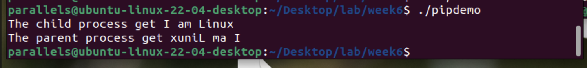
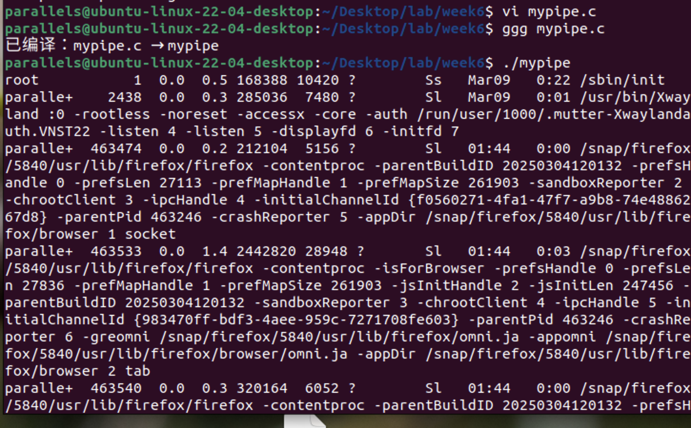
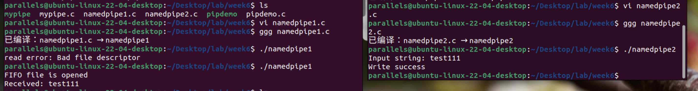
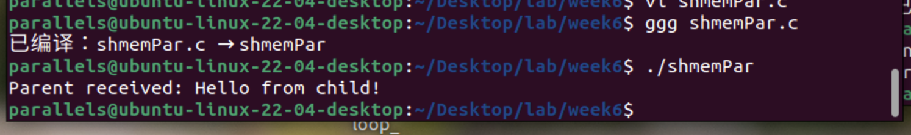
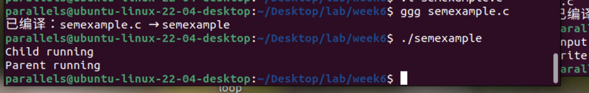

- [**1. 无名管道双向通信（例7-1）**](#1-无名管道双向通信例7-1)
- [**2. 实现 `ps -aux | grep init` 功能（例7-4）**](#2-实现-ps--aux--grep-init-功能例7-4)
- [**3. 命名管道通信（例7-6）**](#3-命名管道通信例7-6)
  - [**读端程序（namedpipe1.c）**](#读端程序namedpipe1c)
  - [**写端程序（namedpipe2.c）**](#写端程序namedpipe2c)
- [**4. 共享内存通信（例7-10）**](#4-共享内存通信例7-10)
- [**5. System V信号量控制进程顺序（例7-8）**](#5-system-v信号量控制进程顺序例7-8)
  - [其他注意事项：](#其他注意事项)


整理第7章可执行代码片段后，实践效果如下：

---

### **1. 无名管道双向通信（例7-1）**
```c
/* pipedemo.c */
#include<stdio.h>
#include<unistd.h>
#include<fcntl.h>
#include<stdlib.h>
#include<string.h>

char sendbuf[] = "I am Linux";
char recbuf[20];
char parrecbuf[20];

void reverse(char *str1) {
    if (str1 == NULL) return;
    char *p = str1;
    char *q = str1;
    while (*q) q++;
    q--;
    while (q > p) {
        char t = *p;
        *p++ = *q;
        *q-- = t;
    }
}

int main() {
    int mypipe[2], fd;
    if (pipe(mypipe) < 0) { perror("pipe failed"); exit(0); }
    if ((fd = fork()) < 0) { perror("fork failed"); exit(0); }

    if (fd == 0) { // 子进程
        read(mypipe[0], recbuf, strlen(sendbuf));
        printf("The child process get %s\n", recbuf);
        reverse(recbuf);
        write(mypipe[1], recbuf, strlen(recbuf));
    }

    if (fd > 0) { // 父进程
        write(mypipe[1], sendbuf, strlen(sendbuf));
        sleep(1); // 等待子进程处理（原代码为sleep(10)，缩短等待时间）
        read(mypipe[0], parrecbuf, strlen(sendbuf));
        printf("The parent process get %s\n", parrecbuf);
        wait(NULL); // 防止僵尸进程
    }
    return 0;
}
```
**编译运行**：
```bash
gcc pipedemo.c -o pipedemo && ./pipedemo
```
**输出**：
```
The child process get I am Linux
The parent process get xuniL ma I
```



---

### **2. 实现 `ps -aux | grep init` 功能（例7-4）**
```c
/* mypipe.c */
#include<unistd.h>
#include<fcntl.h>
#include<stdio.h>
#include<sys/types.h>
#include <stdlib.h>

int main() {
    int pid, mypipe[2];
    pipe(mypipe);
    pid = fork();

    if (pid < 0) {
        perror("create process failed\n");
        exit(0);
    }

    if (pid == 0) { // 子进程执行 grep init
        close(mypipe[1]);
        dup2(mypipe[0], 0); // 将管道读端重定向到标准输入
        close(mypipe[0]);
        execlp("grep", "grep", "init", NULL);
    } else { // 父进程执行 ps aux
        close(mypipe[0]);
        dup2(mypipe[1], 1); // 将管道写端重定向到标准输出
        close(mypipe[1]);
        execlp("ps", "ps", "aux", NULL);
    }
}
```
**编译运行**：

```bash
gcc mypipe.c -o mypipe && ./mypipe
```
**输出**：显示系统中包含 "init" 的进程信息。



---

### **3. 命名管道通信（例7-6）**
#### **读端程序（namedpipe1.c）**

```c
#include <stdio.h>
#include <stdlib.h>
#include <sys/types.h>
#include <sys/stat.h>
#include <fcntl.h>    // 添加此头文件以支持 O_RDONLY
#include <unistd.h>   // 添加此头文件以支持 read()
#include <error.h>

#define N 20

int main() {
    int fd = open("/tmp/mypipe", O_RDONLY); // 确保命名管道已创建
    char buf[N];
    if (fd != -1) printf("FIFO file is opened\n");
    if (read(fd, buf, N) != -1)
        printf("Received: %s\n", buf);
    else
        perror("read error");
    close(fd);
    exit(EXIT_SUCCESS);
}
```

#### **写端程序（namedpipe2.c）**
```c
#include <stdio.h>
#include <stdlib.h>
#include <sys/types.h>
#include <sys/stat.h>
#include <fcntl.h>    // 添加此头文件以支持 O_WRONLY
#include <unistd.h>   // 添加此头文件以支持 write()
#include <error.h>

#define N 20

int main() {
    mkfifo("/tmp/mypipe", 0777); // 创建命名管道
    int fd = open("/tmp/mypipe", O_WRONLY);
    char buf[N];
    printf("Input string: ");
    scanf("%s", buf);
    if (write(fd, buf, sizeof(buf)) != -1)
        printf("Write success\n");
    close(fd);
    exit(EXIT_SUCCESS);
}
```
**运行步骤**：
1. 终端1：`gcc namedpipe1.c -o reader && ./reader`（阻塞等待数据）
2. 终端2：`gcc namedpipe2.c -o writer && ./writer`（输入字符串后，终端1显示结果）



---

### **4. 共享内存通信（例7-10）**
```c
// shmemPar.c
#include <stdio.h>
#include <unistd.h>
#include <string.h>
#include <sys/ipc.h>
#include <sys/shm.h>

#define SIZE 1024

int main() {
    int shmid = shmget(IPC_PRIVATE, SIZE, IPC_CREAT | 0600);
    char *shmaddr;
    pid_t pid = fork();

    if (pid == 0) { // 子进程写入数据
        shmaddr = shmat(shmid, NULL, 0);
        strcpy(shmaddr, "Hello from child!");
        shmdt(shmaddr);
    } else { // 父进程读取数据
        sleep(1); // 等待子进程写入
        shmaddr = shmat(shmid, NULL, 0);
        printf("Parent received: %s\n", shmaddr);
        shmdt(shmaddr);
        shmctl(shmid, IPC_RMID, NULL); // 删除共享内存
    }
    return 0;
}
```
**编译运行**：
```bash
gcc shmemPar.c -o shmemPar && ./shmemPar
```
**输出**：
```
Parent received: Hello from child!
```



---

### **5. System V信号量控制进程顺序（例7-8）**
完整代码需拆分头文件 `semlib.h` 和主程序 `semexample.c`，此处提供简化版本：
```c
// semexample.c
#include <sys/types.h>
#include <sys/ipc.h>
#include <sys/sem.h>
#include <unistd.h>
#include <stdio.h>

union semun { int val; };

int main() {
    int sem_id = semget(IPC_PRIVATE, 1, 0666 | IPC_CREAT);
    union semun arg;
    arg.val = 0;
    semctl(sem_id, 0, SETVAL, arg); // 初始化信号量为0

    if (fork() == 0) { // 子进程
        printf("Child running\n");
        sleep(1);
        struct sembuf op = {0, 1, 0}; // V操作
        semop(sem_id, &op, 1);
    } else { // 父进程
        struct sembuf op = {0, -1, 0}; // P操作
        semop(sem_id, &op, 1);
        printf("Parent running\n");
        semctl(sem_id, 0, IPC_RMID); // 删除信号量
    }
    return 0;
}
```
**编译运行**：
```bash
gcc semexample.c -o semexample && ./semexample
```
**输出**：
```
Child running
Parent running
```



---

#### 其他注意事项：

*需先通过 `mkfifo` 命令或代码创建管道文件。

*使用后需及时清理资源（如 `shmctl` 和 `semctl`）。

*注意头文件依赖，如 `<sys/ipc.h>`、`<sys/shm.h>` 等需包含完整。

