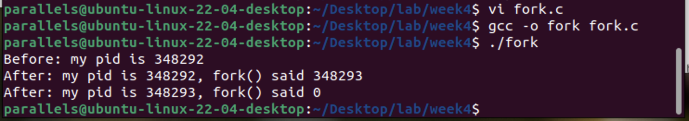
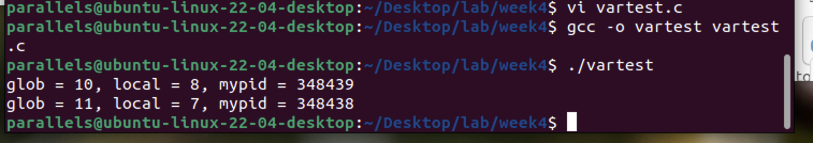
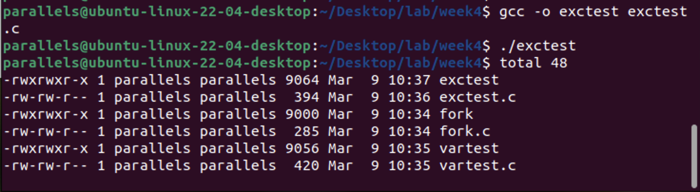
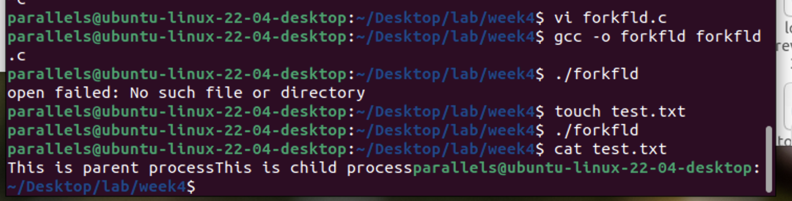
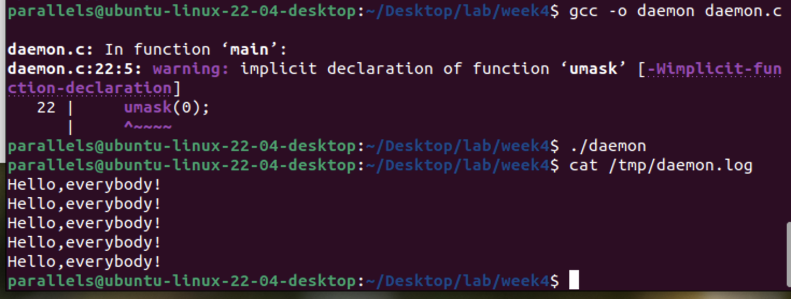
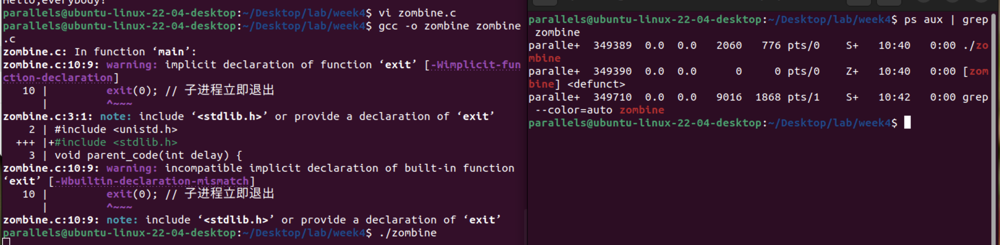
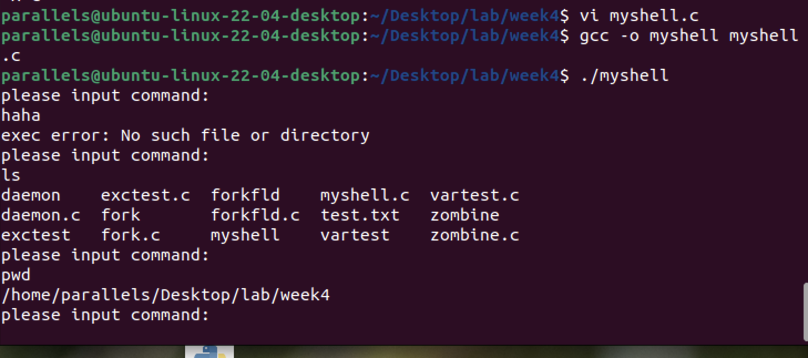

- [**1. fork操作实例（例5-1）**](#1-fork操作实例例5-1)
- [**2. 父子进程数据独立性示例（例5-2，vartest.c）**](#2-父子进程数据独立性示例例5-2vartestc)
- [**3. execvp系统调用演示程序（例5-3，exctest.c）**](#3-execvp系统调用演示程序例5-3exctestc)
- [**4. 文件描述符共享示例（例5-4，forkfld.c）**](#4-文件描述符共享示例例5-4forkfldc)
- [**5. 守护进程创建示例（例5-5，daemon.c）**](#5-守护进程创建示例例5-5daemonc)
- [**6. 僵尸进程示例（例5-6，zombine.c）**](#6-僵尸进程示例例5-6zombinec)
- [**7. 简单Shell实现（例5-8，myshell.c）**](#7-简单shell实现例5-8myshellc)


#### **1. fork操作实例（例5-1）**

```c
#include <stdio.h>
#include <unistd.h>
int main() {
    int ret_from_fork, mypid;
    mypid = getpid();
    printf("Before: my pid is %d\n", mypid);
    ret_from_fork = fork();
    sleep(1);
    printf("After: my pid is %d, fork() said %d\n", getpid(), ret_from_fork);
    return 0;
}
```



---

#### **2. 父子进程数据独立性示例（例5-2，vartest.c）**
```c
#include <sys/types.h>
#include <unistd.h>
#include <stdio.h>
int glob = 10; // 全局变量
int main(void) {
    int local;
    pid_t pid;
    local = 8;
    if ((pid = fork()) == 0) {
        // 子进程
        sleep(2);
    } else if (pid > 0) {
        // 父进程
        glob++;
        local--;
        sleep(10);
    }
    printf("glob = %d, local = %d, mypid = %d\n", glob, local, getpid());
    return 0;
}
```



---

#### **3. execvp系统调用演示程序（例5-3，exctest.c）**

```c
#include <unistd.h>
#include <stdio.h>
#include <string.h>
int main() {
    char *arglist[3];
    pid_t pid;
    arglist[0] = "ls";
    arglist[1] = "-l"; // 修正参数为 "-l"
    arglist[2] = NULL; // 修正结束符为NULL
    pid = fork();
    if (pid == 0) {
        execvp("ls", arglist);
        printf("*** program is over. bye\n"); // 若exec失败才会执行
    }
    return 0;
}
```



---

#### **4. 文件描述符共享示例（例5-4，forkfld.c）**
```c
#include <stdio.h>
#include <stdlib.h>
#include <unistd.h>
#include <sys/types.h>
#include <fcntl.h>
#include <string.h>
int main() {
    char buf[10];
    char *str1 = "This is child process";
    char *str2 = "This is parent process";
    pid_t pid;
    int fd, readsize;
    fd = open("test.txt", O_WRONLY); // 修正为O_WRONLY
    if (fd == -1) {
        perror("open failed");
        exit(0);
    }
    readsize = read(fd, buf, 5); // 读取5字节
    pid = fork();
    switch (pid) {
        case -1:
            perror("fork failed");
            exit(0);
        case 0:
            write(fd, str1, strlen(str1));
            break;
        default:
            write(fd, str2, strlen(str2));
    }
    close(fd);
    return 0;
}
```



---

#### **5. 守护进程创建示例（例5-5，daemon.c）**

```c
#include <stdio.h>
#include <stdlib.h>
#include <string.h>
#include <fcntl.h>
#include <sys/types.h>
#include <unistd.h>
#define MAXFILE 65535
int main() {
    pid_t pc;
    int i, fd, len;
    char *buf = "Hello,everybody!\n";
    len = strlen(buf);
    pc = fork();
    if (pc < 0) {
        printf("fork error\n");
        exit(1);
    } else if (pc > 0) {
        exit(0); // 父进程退出
    }
    setsid();    // 修正为setsid()
    chdir("/");
    umask(0);
    for (i = 0; i < MAXFILE; i++) close(i); // 关闭所有文件描述符
    while (1) {
        fd = open("/tmp/daemon.log", O_CREAT | O_WRONLY | O_APPEND, 0600);
        if (fd < 0) {
            perror("open");
            exit(1);
        }
        write(fd, buf, len);
        close(fd);
        sleep(10);
    }
    return 0;
}
```



---

#### **6. 僵尸进程示例（例5-6，zombine.c）**

```c
#include <stdio.h>
#include <unistd.h>
void parent_code(int delay) {
    sleep(delay);
}
int main() {
    pid_t pid;
    pid = fork();
    if (pid == 0) {
        exit(0); // 子进程立即退出
    } else if (pid > 0) {
        parent_code(100000); // 父进程长期睡眠
    }
    return 0;
}
```



---

#### **7. 简单Shell实现（例5-8，myshell.c）**
```c
#include <stdio.h>
#include <stdlib.h>
#include <string.h>
#include <unistd.h>
#include <sys/wait.h>
void split(char **arr, char *str, const char *del) {
    char *s = strtok(str, del);
    while (s != NULL) {
        *arr++ = s;
        s = strtok(NULL, del);
    }
}
int main() {
    char *args[10];
    char arg[100];
    pid_t pid;
    int status;
    while (1) {
        printf("please input command:\n");
        memset(args, 0, sizeof(args));
        if (fgets(arg, sizeof(arg), stdin) == NULL) break; // 替换不安全的gets
        arg[strcspn(arg, "\n")] = '\0'; // 去除换行符
        if (strcmp("#", arg) == 0) break;
        split(args, arg, " ");
        pid = fork();
        if (pid < 0) {
            printf("fork failed\n");
            exit(0);
        } else if (pid == 0) {
            execvp(args[0], args); // 修正参数传递
            perror("exec error");
            exit(1);
        } else {
            wait(&status);
        }
    }
    return 0;
}
```


